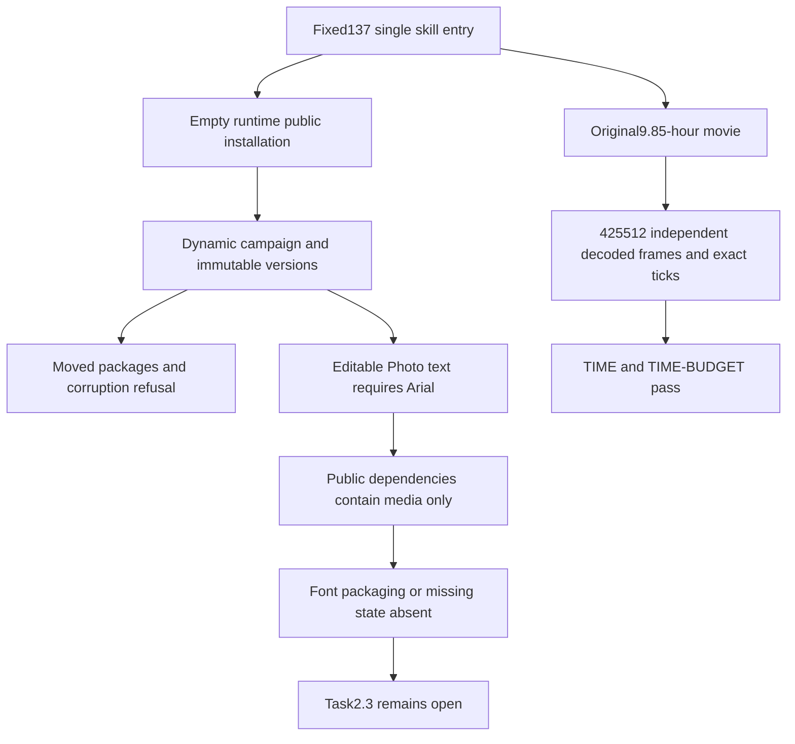

# ArtCraft current artifact protocol acceptance architecture

Scope: fixed plugin137 / source109 / runtime136-runtime.1. Exact-time and long-call budget scenarios pass. Nine of eleven CP-002 scenarios have current evidence; two retain an actual font-dependency gap. Task2.3 and full V1 remain open.

## Native evidence and limits

The original9.85-hour,12fps sparse large-tick timeline completes full export in416.102seconds. Its1,434,591,900-byte movie independently decodes425,512frames. Native start9007199254740993 and end9007220422740993 remain decimal ticks; exported duration9007238016000000 differs by less than one frame, with timebase1/254016000000. JSON exchange preserves strings, and input/project/reopen/probe references bind content hashes. Timeline length and frame rate were preserved.

A single skill extracted from the immutable137 plugin ZIP uses default public downloads into empty runtime homes for the four-domain five-node dynamic campaign, immutable Vector versions, and progressive JPEG Photo import. Logo changes rebuild dependent consumers while the independent task, voice and background remain reusable. A corrupt middle frame blocks delivery; restoration reuses tasks and budgets. The moved package verifies five native children. Photo PNG/PSD independently decode; reopening the native source also exports JPEG with verified public image metadata. All72 entry-tree files still match the immutable ZIP after tests.

## Scenario audit

| Scenario | Current conclusion |
| :--- | :--- |
| JPEG | Native import, PNG/PSD decoding, content facts and migration pass |
| P contract and fields | Partial; native editable font requirements are absent from dependencies |
| N invalidation | Logo propagation, independent reuse, preserved voice and cycle refusal pass |
| VERSION | Immutable conflict refusal, new versions and replay preservation pass |
| PATH | Relative package migration passes; font dependency/missing state remains absent |
| IMAGE | Native derived PNG/JPEG metadata and independent decoding pass |
| TIME | Full long movie, precise JSON exchange and frame boundaries pass |
| External JSON | Digest, syntax, exact16MiB acceptance and one-byte overflow refusal pass |
| WAV | Real PCM input, native audio, moved package and malformed/claim refusals pass |
| PNG | Current depth/color/Adam7 and CRC/compression corpus plus native handoff pass |
| TIME-BUDGET | Actual export crosses old180second limit; deadline/identity/scope/cap/expiry tests pass |

The [machine audit](evidence/artifact-protocol-scenario-audit137-20261009.json) separates native workflows from controlled failures. The fixed core passes101 initial tests,14 updated JSON-target tests and30 engine tests:132 distinct tests after removing repeated protocol targets. Illegal files, resource limits and ambiguity use controlled fixtures. Actual native saving, export, reopening, version refusal and migration do not establish creative quality.

## Confirmed font gap and next implementation

Actual Photo inspection records `/layers/0/text/font = Arial`; public artifacts declare media dependencies only. The Art adapter derives media/LUT dependencies from input sourceRefs but does not map native editable font requirements. This leaves migration verification without font availability evidence. The [confirmed gap](evidence/font-dependency-gap137-20261009.json) binds inspection, project and artifact hashes.

Next work must add Art-owned font requirement detection, trusted source or explicit missing state, dependency version binding and migration verification, starting with failing tests. Do not fabricate fonts, equate outlines/rendered pixels with editable text, or treat an undeclared font as packaged. Original requirements remain intact.

The old fixed136180second failure remains retained. Historical generated QA runtime/host caches were reversibly archived after per-file hash verification; projects, inputs, receipts and logs remain. Cleanup is not product capability. This report does not qualify a new Codex host, generic Skills CLI, Vector duplicate catalogs, creative quality, other platforms or full V1.
