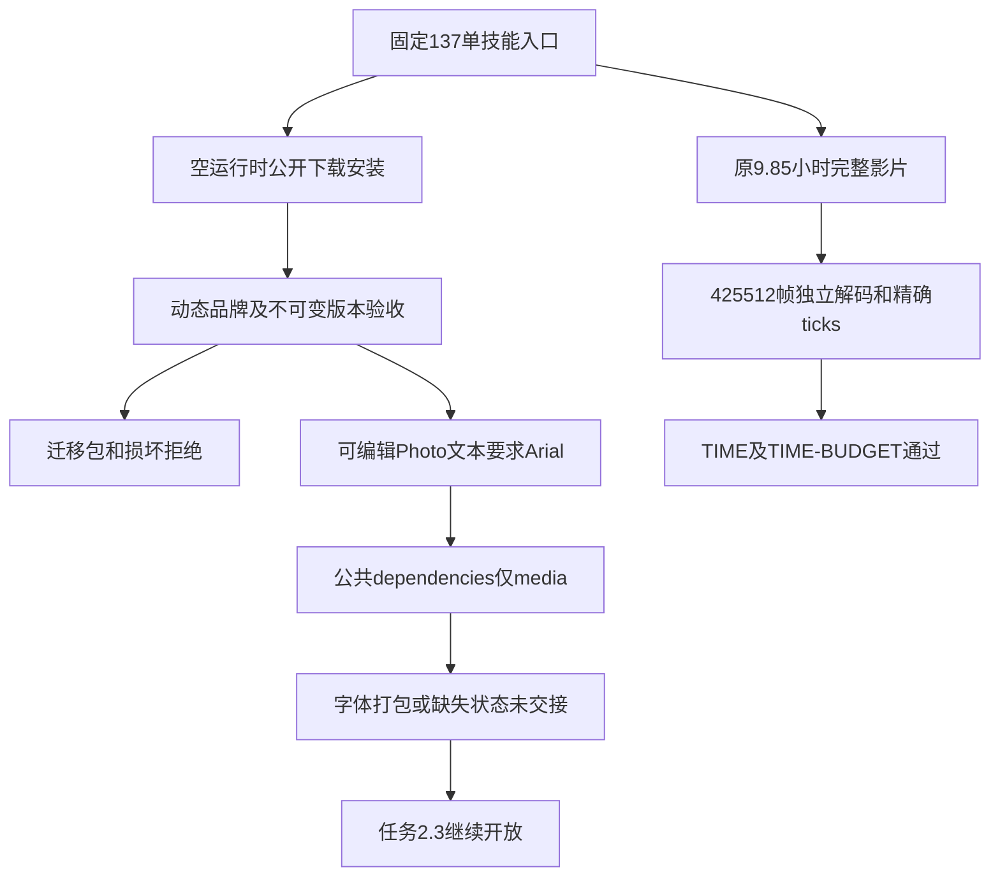

# ArtCraft 素材协议当前验收架构

本次核验固定插件137／技能源109／运行时136-runtime.1。结果：精确时间与长导出预算场景通过；公共素材协议11个具名场景中9项有当前证据、2项因字体依赖缺口保持部分验收，任务2.3及完整V1继续开放。

## 原生证据与边界

原9.85小时、12fps、大整数稀疏时间线完整导出通过，总耗时416.102秒，成片1,434,591,900字节，独立逐帧解码425,512帧。原生起始ticks为9007199254740993，原生结束ticks为9007220422740993，成片ticks为9007238016000000；差值小于一帧，时间基准为1/254016000000。JSON往返仍为十进制字符串，工程、输入、原生重开和成片探测引用均按摘要绑定。没有缩短时间线或降低帧率。

固定插件ZIP单技能提取后，通过默认公开下载分别执行：四领域五节点动态品牌、Vector不可变素材版本、Photo渐进JPEG导入。Logo变更更新传递消费者，独立任务复用，背景和配音原字节不变；中间帧损坏阻断交付，修复后任务与预算复用；移动包验证五个原生子工程。Photo保留图层并交付可独立解码PNG／PSD，原生源重开后另导出JPEG并核对公共图片属性。实际入口72个文件在测试后仍与不可变插件ZIP逐字节一致。

## 逐场景审计

| 场景 | 当前结论 |
| :--- | :--- |
| JPEG | 原生导入、PNG／PSD解码、内容登记和迁移通过 |
| P 合同与字段 | 部分通过；字体依赖字段未覆盖真实可编辑工程要求 |
| N 失效规则 | Logo传递失效、独立复用、配音保全与循环拒绝通过 |
| VERSION | 同版本冲突拒绝、新版本及重放保全通过 |
| PATH | 相对包迁移通过；字体仍没有显式依赖与缺失状态 |
| IMAGE | 原生PNG和JPEG派生图属性及独立解码通过 |
| TIME | 完整长影片、精确JSON交接与帧边界通过 |
| 外部JSON | 摘要、语法、16MiB临界接受与超一字节拒绝通过 |
| WAV | 实际PCM配音、原生音轨、移动包及格式／声明错误拒绝通过 |
| PNG | 当前合法深度／颜色／Adam7与CRC／压缩拒绝语料、实际原生交接通过 |
| TIME-BUDGET | 真实导出跨越180秒旧限制；截止时间／身份／范围／上限与过期拒绝通过 |

上述验收组合区分实际原生流程与受控故障；详细覆盖见[机器审计](evidence/artifact-protocol-scenario-audit137-20261009.json)。固定核心初始101项、更新JSON目标14项、工作流引擎30项通过；去除重复协议目标后共132个不同测试。非法输入、容量上限和JSON歧义采用受控文件；真实执行覆盖原生保存、导出、重开、版本拒绝与迁移，不把它们混称创作验收。

## 已证实的字体缺口与下一步

当前Photo原生检查明确记录 `/layers/0/text/font = Arial`，公共产物只有media依赖。Art适配器目前由输入sourceRefs生成media／LUT依赖，没有将原生可编辑文本的字体要求交接为字体依赖。这不是单纯缺报告：它会让迁移核验缺少判断字体可用性的材料。[实际缺口证据](evidence/font-dependency-gap137-20261009.json)绑定原生检查、工程和公共产物摘要。

下一步在Art范围内补齐字体需求识别、受信字体来源／缺失状态、依赖版本绑定及迁移核验，并先建立失败用例。不能伪造字体文件、把轮廓／渲染等同可编辑文本，或把未声明字体当成已经打包。需求保持原规范，未将其删减为渲染通过。

旧固定136的180秒失败仍保留；旧验收运行时和宿主缓存进行了逐文件摘要核验后的可恢复归档，原生工程、输入、回执和日志保留。该整理不计入产品能力。新Codex宿主、通用Skills CLI、Vector目录歧义、创作质量、跨平台及完整V1均不由本报告证明。
