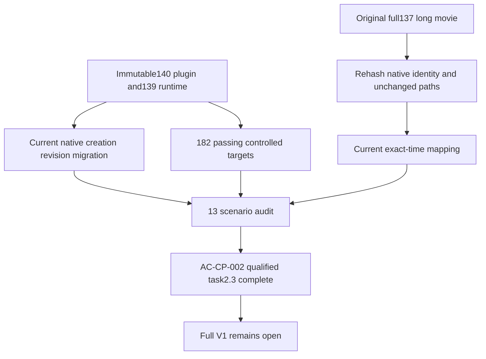

# ArtCraft public artifact protocol qualification

AC-CP-002 qualifies on macOS arm64 for fixed plugin140 / source112 / runtime139-runtime.1. All13 named scenarios have explicit evidence; task2.3 completes. Full V1 and the remaining11 numbered tasks stay open. The OpenSpec change remains active and is not archived or promoted to a delivered baseline.

## Evidence and boundaries

Current fixed-plugin native runs pass dynamic five-node creation, selective Logo revision, independent reuse, original voice/background preservation, corruption rejection and recovery without replay, and moved packaging. A separate actual Vector run verifies three repeated/cross-authorization immutable-version conflicts before registration, preserving12 tables and22 files, then accepts a new version and reuses its task/budget. Current Photo imports progressive JPEG by content; PNG, PSD and JPG outputs independently decode, and the JPG derivative's public raster/depth/alpha facts match actual bytes.

The fixed140 dependency acceptance supplies all four native font requirements with explicit uncollected state, two successive source reopens, media/LUT identity retention, Effect replacement/reuse, incomplete-package refusal and moved-package verification. A separate fixed-plugin segmented-sequence probe verifies normalized descriptor identity and original lineage; its320×180 size does not replace retained HD acceptance.

The immutable core ZIP matches39 extracted runtime files. Nineteen current test files execute183 targets:182 pass, one optional native Effect test skips. Actual current public Effect execution is separately covered by the dynamic and inherited native runs; the skip is not reported as a pass. Current source regression:215 tests,162 pass,53 conditional skips.

## Scenario coverage

| Scenario | Evidence |
| :--- | :--- |
| JPEG | Actual content import, native editable Photo, PNG/PSD/JPG independent decoding and migration; controlled invalid formats/claims |
| FONT | Four native domains and repeated reopening/reuse; complete style/keyframe extraction and missing-state/size/depth/binding refusals |
| P contract | Current schema, identity, native/loss/evidence/metadata/dependency records and packaging |
| N invalidation | Current Logo transitive rebuild, independent reuse, source preservation; cycle rejection |
| VERSION | Actual three pre-registration refusals and new version/replay; controlled concurrent/output namespace conflicts |
| PATH | Current moved five-node, JPEG, inherited and normalized-sequence packages; path/digest negative tests |
| INHERIT | Current actual media/LUT inheritance, replacement, normalized identity; controlled unknown/multiple identity rules |
| IMAGE | Current PNG/JPG derivatives, independent decoding and actual content metadata; adapter digest-change rejection |
| TIME | Current immutable mapping and full retained long-movie digest/native identity revalidation; exact JSON/frame evidence |
| External JSON | Current full syntax/digest, exact16MiB acceptance, overflow and unknown-field refusals |
| WAV | Current actual48kHz PCM narration handoff/preservation and controlled chunk/format/claim refusals |
| PNG | Current actual import/output plus legal color/depth/Adam7 and malformed/resource/APNG refusal corpus |
| TIME-BUDGET | Retained full long export/decode with unchanged paths; current actual OS-child and identity/deadline/cap tests |

## Retained long-time evidence

The9.85-hour original movie remains1,434,591,900 bytes and425,512 independently decoded frames. Current code rehashes the entire movie, native project and report references and applies the fixed139 immutable time-metadata validator. Export duration9007238016000000 remains a decimal string with timebase1/254016000000. Nine time/runner/format/graph source paths and the native executable are byte-identical to the qualified137 chain.

This reuses only unchanged time/budget/render behavior and the original full-frame decode. It does not claim a new140 long re-render, relabel the old receipt, rewrite historical outputs, or qualify old incomplete dependency/package records. The changed public adapter context is covered by current fixed native workflows and exact-time adapter tests. The initial time QA selected an Effect-only receipt; switching to the current four-domain receipt resolved the test invocation error without changing product files.

See the [machine qualification](evidence/ac-cp-002/qualification140-20261009.json) for scenario-specific test files, source/proof/log digests and immutable runtime/skill inventories. The tests now explicitly support either default cold installation or a supplied existing cache; proof records distinguish both. This round uses warm public pinned caches and does not establish new host-wide/cold qualification, other platforms, generic Skills CLI installation, font-file portability or creative quality. No runtime or skill distribution files changed.
