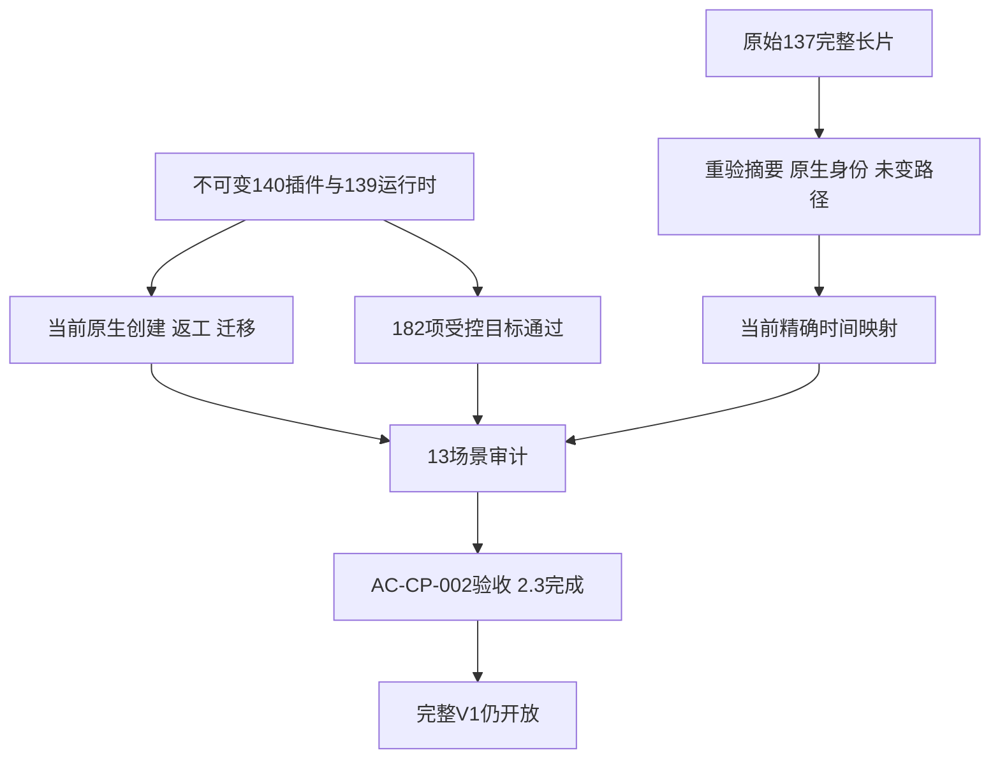

# ArtCraft 公共素材协议验收

AC-CP-002在macOS arm64、固定插件140／技能源112／runtime139-runtime.1范围内验收完成。13个具名场景均有明确证据，任务2.3完成。完整V1及剩余11个编号任务保持开放；OpenSpec变更继续有效，不归档、不提升为完整交付基线。

## 证据与边界

当前固定插件通过动态五节点创建、Logo选择性返工、独立节点复用、原配音与背景保全、损坏帧拒绝及不重放恢复、移动包核验。独立Vector真实流程在登记前拒绝三次重复／跨授权的同版本内容冲突，保全12张表及22个文件，随后接受新版本并复用任务与预算。当前Photo按内容导入渐进JPEG，PNG、PSD及JPG产物均独立解码，JPG的公共尺寸／位深／Alpha与实际编码一致。

固定140依赖验收提供四领域原生字体的明确未收集状态、连续两次源重开、媒体与LUT身份继承、Effect替换复用、不完整包拒绝及移动包核验。另一个固定插件分段序列样本验证规范化描述身份与原始血缘；其320×180尺寸不替代已保留的HD验收。

不可变核心ZIP的39个运行时文件与提取目录逐项相等。19份当前测试执行183项目标，182通过，1项可选Effect原生测试跳过。当前真实公开Effect执行由动态及继承素材原生流程另行覆盖，未把跳过计为通过。当前技能源回归215项，162通过、53条件跳过。

## 场景覆盖

| 场景 | 证据 |
| :--- | :--- |
| JPEG | 当前真实内容导入、可编辑Photo、PNG／PSD／JPG独立解码及迁移；非法格式／声明拒绝 |
| FONT | 四领域真实文字、连续重开复用；完整样式／关键帧提取及缺失／大小／深度／绑定拒绝 |
| P合同 | 当前schema、身份、原生／损失／证据／元数据／依赖记录与打包 |
| N失效 | 当前Logo传递返工、独立复用、源文件保全；循环拒绝 |
| VERSION | 真实三次登记前拒绝与新版本／复用；并发输出及身份隔离受控验证 |
| PATH | 当前五节点、JPEG、继承素材和规范化序列移动包；路径／摘要负向验证 |
| INHERIT | 真实媒体／LUT继承、替换、规范化身份；未知／多重历史身份规则 |
| IMAGE | 当前PNG／JPG导出、独立解码及内容元数据；适配器摘要变化拒绝 |
| TIME | 当前不可变映射及保留整片摘要／原生身份重验；精确JSON／帧边界证据 |
| 外部JSON | 当前完整语法／摘要、精确16MiB接收、超限及未知字段拒绝 |
| WAV | 当前真实48kHz PCM配音交接保全；块／格式／声明拒绝 |
| PNG | 当前真实导入导出；合法颜色／位深／Adam7及损坏／资源／APNG拒绝语料 |
| TIME-BUDGET | 保留完整长导出解码及未变路径；当前真实OS子进程、身份／期限／上限验证 |

## 长时间线证据复用

原始9.85小时影片保持1,434,591,900字节、425,512帧独立解码证明。当前代码重新核验完整影片、原生工程和报告引用摘要，并使用固定139不可变核心的时间元数据校验器。导出duration9007238016000000保持十进制字符串，时间基1/254016000000。9个时间／执行器／格式／图路径及原生程序字节与已验收137发行链一致。

仅复用未变化的时间、调用预算、渲染行为及原始整片解码，不声称140重新渲染长片，不改标旧回执、不改写历史产物，不把旧不完整依赖／包记录提升为当前合格交付。已变化的公共适配器上下文由当前固定原生流程及精确时间适配器测试覆盖。首次时间QA选中了只含Effect的回执；改用当前四领域回执解决调用错误，没有修改产品文件。

[机器验收记录](evidence/ac-cp-002/qualification140-20261009.json)绑定逐场景测试文件、源码／证明／日志摘要及不可变运行时／技能清单。测试现在显式区分默认冷安装与指定现有缓存，证明记录同步区分。本轮使用公开锁定安装器及已有缓存，不证明新的全宿主／冷安装、其他平台、通用Skills CLI、字体文件迁移或创作质量。未修改运行时或技能分发文件。
