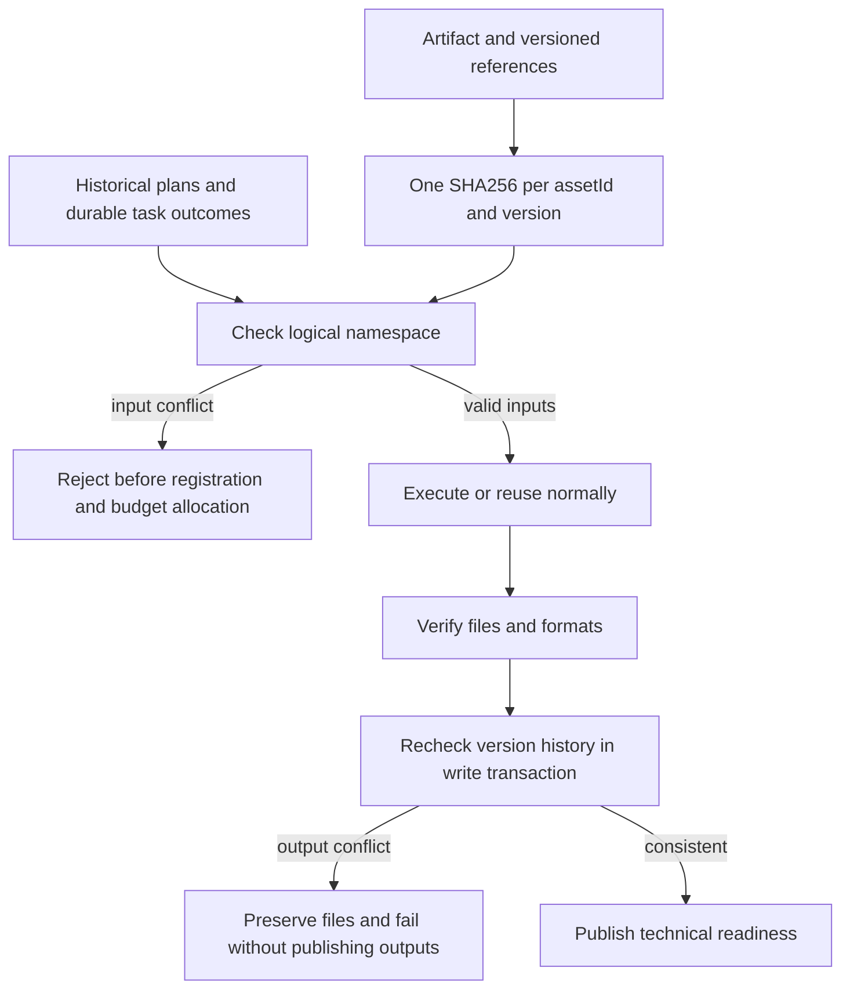

# ArtCraft immutable artifact versions

AC-CP-002 requires immutable content per artifact version. Runtime `0.1.0-dev.123-runtime.1`, independent skills `0.1.0-dev.95` and plugin `0.1.0-dev.123` now contain the protection and have fixed installed acceptance. Tasks 2.1 and 2.2 are verified; complete protocol acceptance 2.3 remains open.

## Data and control flow

## Implementation and use

`src/protocol/artifact_versions.ts` checks the artifact, sourceRefs, nativeProjectRef, renditions, dependencies, lossReportRef and evidenceRefs. Repeated identity/version references can share a digest; different content requires a new version. Relocation does not change identity. JSON array keys avoid concatenation collisions.

`src/harness/task_ledger.ts` checks inputs and historical outputs inside SQLite write transactions. Workflows use ownerId and workflowId as their namespace, shared across revisions and authorization scopes. Standalone tasks use callerId and projectKey. History includes frozen plans, node records and durable task outcomes, so replacing a node summary cannot erase a published version. Input refusal precedes new budget and task registration. Output publication checks prevent concurrent producers from assigning different contents to one version. Existing tables are reused without initialization or migration; contradictory legacy history is preserved and refused, including replay of frozen revisions.

`src/harness/local_runner.ts` retains the supported artifact_version_conflict code. Other verification failures retain artifact_invalid. A failed task with confirmed stop evidence releases its lease without publishing failed outputs. Unknown-execution recovery rules remain unchanged.

On a conflict, compare the current content with the registered digest. Intended content changes need a new artifact version and plan revision. Changing authorization, retrying, or rewriting old delivery files cannot resolve the conflict. Ordinary Art skill imports derive versions from content hashes; changed files naturally receive new versions. Callers submitting public protocol objects must also preserve immutable versions.

## Evidence and state

[Candidate evidence](evidence/artifact-version-candidate-20261008.json) binds 17 target RED/GREEN tests, complete runtime regression, a four-domain native mixed workflow, real concurrent output conflicts and two public Node CLI refusals with ledger/file preservation. It proves candidate code, not a fixed release or installation in the Python skill. Procedural graphics and test audio do not establish creative or human acceptance.

[Fixed installed evidence](evidence/craft-art123-artifact-version-fixed-first-use-20261008.json) binds three byte-matched public archives, five rebuilt bundles, 64 host discoveries and installed CLI probes, and ten newly independent Art cold installations. The 54 unchanged domain cold records are reused only after exact whole-tree identity equality; they are not newly rerun cold installations. One installed execution skill creates three native versions, refuses three mutable-version requests before registration, preserves all 12 ledger tables and 20 old delivery files, and reuses the valid revision without extra budget. The actual four-domain creation/revision/moved-package test and both argument tests pass. All 64 installed skill trees remain unchanged. Eight fixed-commit CI runs pass.

Complete JPEG, PNG, WAV, dynamic sequence, exact time and consumer matrices remain under 2.3. Generic Skills CLI installation 3.16 remains open. These technical results do not establish GUI, model dispatch, creative, human or full V1 acceptance. History queries scan the logical project; long-lived large-ledger performance is not claimed.

The current-all-repository source audit refuses because the four domain working copies differ from the pinned tags; ArtCraft tracked skill bytes match. This is distinct from the accepted immutable-tag installation. Other domain repositories were not modified.
