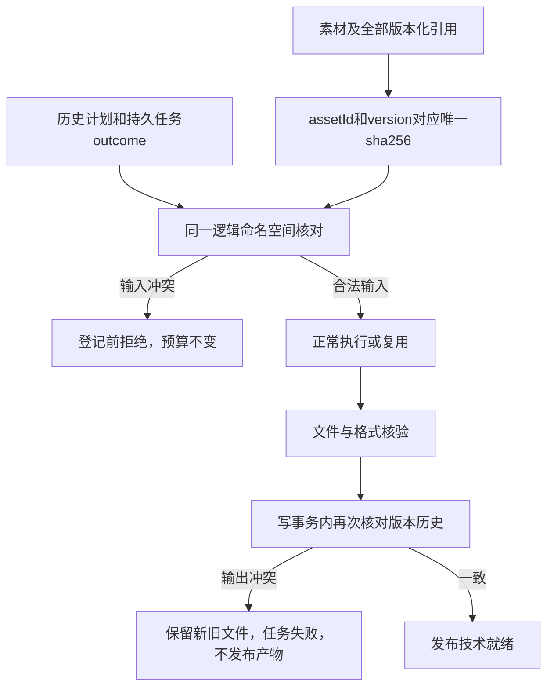

# ArtCraft 素材版本不可变候选

现有 AC-CP-002 规定同一素材版本不能修改内容。本次补充 VERSION 场景明确命名空间及拒绝时点，并修复运行时缺口。代码为未发布候选；公开固定 runtime122/source94/plugin122 尚未包含该保护。任务2.1的失败测试完成；2.2的固定交付材料及2.3完整验收仍待完成。

## 数据与控制流

## 实现与使用

`src/protocol/artifact_versions.ts` 核对素材本身、sourceRefs、nativeProjectRef、renditions、dependencies、lossReportRef及evidenceRefs。相同ID和版本可重复引用同一摘要；改变内容必须使用新版本。路径迁移不改变身份，JSON数组编码组合键避免字符串拼接碰撞。

`src/harness/task_ledger.ts` 在SQLite写事务内核对输入和历史产物。工作流按ownerId与workflowId隔离，跨修订及授权范围共享版本历史；独立任务按callerId与projectKey隔离。历史来自冻结计划、节点记录及不可变任务outcome；节点摘要重写不能抹掉已经发布的版本。拒绝新输入发生在预算与新任务登记之前，输出核验后的发布事务防止并发生产者覆盖同一版本。沿用现有表，不初始化或迁移账本，不自动修改旧历史；存在矛盾历史时，旧冻结修订也会被拒绝，不能以复用绕过。

`src/harness/local_runner.ts` 对受支持的版本冲突保留精确artifact_version_conflict，其余核验异常继续使用既有artifact_invalid。已确认停止的失败任务释放占用，但不发布失败输出；未知执行的恢复规则不变。

调用方遇到版本冲突，应核对当前素材与原始登记摘要。内容确需变化时创建新版本及计划修订；不要更换授权或重复提交来绕过冲突，也不要改写旧交付。Art技能普通素材登记以内容摘要生成版本，正常替换文件会产生新版本。直接提交公共协议的调用方同样必须遵守版本不可变规则。

## 证据与状态

[候选证据](evidence/artifact-version-candidate-20261008.json) 包含17项目标测试的红绿结果、完整运行时回归、四领域原生混合流程、真实并发输出冲突，以及公开Node CLI两次拒绝的账本和文件保全结果。它证明候选代码，不证明固定发行或Python技能已经安装该修复。程序化图形和测试音频不代表创作或人工验收。

后续固定新运行时、独立技能源与插件，并执行安装后的公开入口和独立冷启动复验，才能关闭2.2的交付缺口。JPEG、PNG、WAV、动态序列、精确时间及跨消费者完整矩阵继续按各自证据完成2.3。历史查询按逻辑项目扫描，当前未声称长期大规模账本性能验收。
