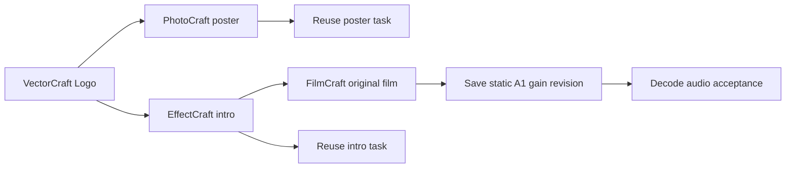

# ArtCraft Mixed-Project Audio Gain Architecture and Acceptance

Fixed plugin dev.47 / source dev.35 retain runtime dev.45 and pin FilmCraft source dev.7. Installed-plugin verification passed. AC-DM-004-GAIN is authoritative; complete V1 acceptance remains open.

The old FilmCraft dev.6 workflow rejected mixer.setStrip. A real old-dependency test created four native projects, then failed the gain revision with unsupported_command in 51.625 seconds while reusing all three upstream tasks. Only the FilmCraft domain bundle changes. Its complete public Git ZIP has SHA-256 1ae806e216fc9fe794bd65fc791c055dbaa62c57ba8155cd4fc7d2e5dad94405, 468688 bytes and 198 files. All ten ArtCraft skills carry the same distribution lock.

Bind the previous native project digest and sourceProject, mark the intro asset binding retained and preserve packaged audio. Only explicit A tracks and finite volumeDb are supported. Do not regenerate upstream assets or voices. Repeated identical revisions reuse tasks and budget.

The candidate artcraft-cli-revise skill copied alone into an isolated .agents/skills publicly installs Node, runtime and four domains into an empty directory. One real test passed in 47.927 seconds, checking decoded -6 dB RMS ratio, four native projects, three upstream task IDs, original files/clip identities/captions/previews and repeat preservation. [Candidate evidence](evidence/audio-gain-mixed-candidate.json). Default source regression: 66 passes and 17 explicit skips; skips are not acceptance.

Multiple-track mixing, automation, GUI, model dispatch and complete creative acceptance remain unverified. Codex 0.153.4 isolated fixed installation discovered 58 skills with zero loading errors. The installed revise skill copied alone passed one real default public cold-install gain test in 52.696 seconds; all 58 host skill hashes were retained. [Installed evidence](evidence/codex-release47-audio-gain-first-use-20261006.json). Jianying uses its own independent plugin outside ArtCraft adaptation.
