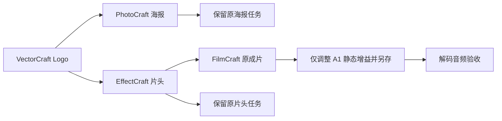

# ArtCraft 混合工程音轨增益架构与验收

当前候选技能源 dev.35 保持运行时 dev.45，固定 FilmCraft 技能源 dev.7；固定插件安装副本复验待完成。规格事实源为 AC-DM-004-GAIN，完整首版验收仍开放。

旧 FilmCraft dev.6 技能工作流拒绝 mixer.setStrip。真实旧依赖验收先完成四工程，再在增益修订因 unsupported_command 失败（51.625 秒）；三个上游任务仍复用。升级只改变 FilmCraft 领域包，公开完整 Git ZIP 的 SHA-256 为 1ae806e216fc9fe794bd65fc791c055dbaa62c57ba8155cd4fc7d2e5dad94405，468688 字节，198 个文件；全部十个 ArtCraft 技能自带相同分发锁。

修订继续使用前次成片原生工程摘要和 sourceProject，intro 绑定标记 retained，配音从原交付保留。参数仅为明确 A 音轨与有限 volumeDb；不增加声音生成授权，不重建 Logo、海报和片头。重复同一修订复用任务与预算。

候选单项 artcraft-cli-revise 技能复制到隔离 .agents/skills，从空目录公开安装 Node、运行时和四领域依赖。真实 1 项通过（47.927 秒），检查实际音频 RMS 的 -6 dB 比例、四原生工程、三个上游 taskId、原文件/片段/字幕/预览与重复调用保全。[候选证据](evidence/audio-gain-mixed-candidate.json)。源默认回归 66 项通过、17 项显式跳过；跳过不计为验收。

不覆盖多轨混音、自动化、GUI、模型派发、完整创作评审；固定发布安装后证据另记。剪映使用自己的插件，不属于 ArtCraft 适配范围。
