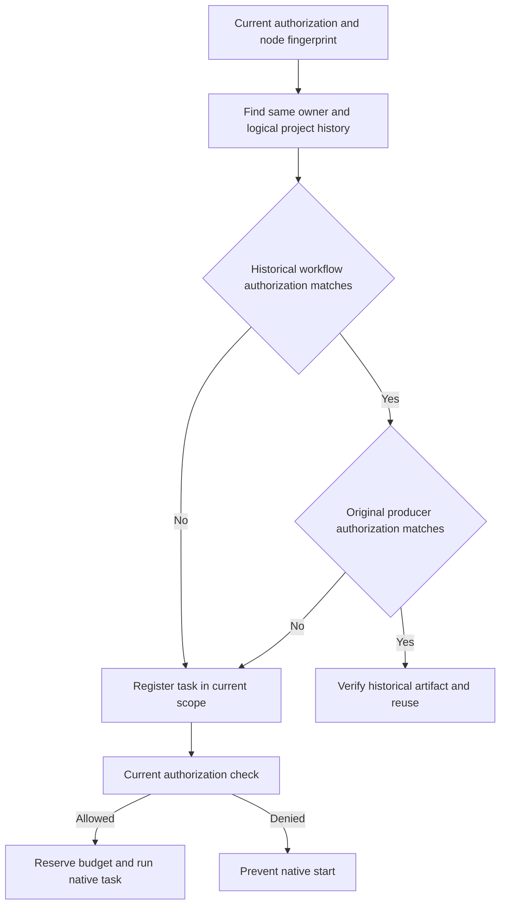

# ArtCraft Authorization Scope and Historical Reuse Architecture

OpenSpec AC-TX-001-CACHE and task 5.11 govern this increment. Candidate orchestration runtime is dev.26; immutable dev.16 remains intact. Development plugin dev.26 is a runtime publication checkpoint whose old skill snapshot still pins dev.16. Updated skills and the final plugin snapshot require a separate publication and verification.

The old lookup checked owner, logical project, node and fingerprint only. A new authorization revision could reuse tasks authorized under the old scope, bypassing the new task's authorization check. Lookup now checks both the historical workflow and original producer authorizationRef. This dual check rejects historical cross-scope reuse records. Existing fingerprints and budgets remain compatible within the same scope; upgrading does not change fingerprints to force all old projects to rerun.

A real failing test reproduced five old tasks being reused without tasks in the new authorization scope. The minimal fix changes only ledger lookup and its caller, preserving public task, artifact and payload schemas. Actual local Node subprocess fixtures prove the contract; they are not four-domain native acceptance. Public-release cold installation and new-scope native execution need separate verification and are currently NOT_RUN.

Published runtime dev.26 has 82 passes and 5 optional native/provider skips among 87 Node tests; the focused workflow suite has 14 passes, including rejected authorization. The old runtime fails the real single-skill cold native task test (19.499 seconds). Candidate skills dev.24 pin runtime dev.26 and pass the same native test (20.006 seconds). Five distribution bundles rebuild from immutable tags; public CLI help is observed at dev.26. This is source-skill evidence; the final installed plugin gate remains NOT_RUN. [Evidence](evidence/authorization-reuse.json).

Published plugin dev.27 / skills dev.24 / runtime dev.26 pass immutable installed-skill verification with default Python 3.14.3. Authorization native cold start passes 1 test in 23.649 seconds; four-domain mixed cold start/replay/conflict/package regression passes 3 tests in 95.854 seconds. All 58 installed skill hashes remain unchanged. Earlier NOT_RUN statements are historical publication checkpoints. The proof binds declared local authorization references; it does not authenticate an external account or establish human acceptance. [Installed evidence](evidence/codex-release28-authorization-native-20261006.json).
