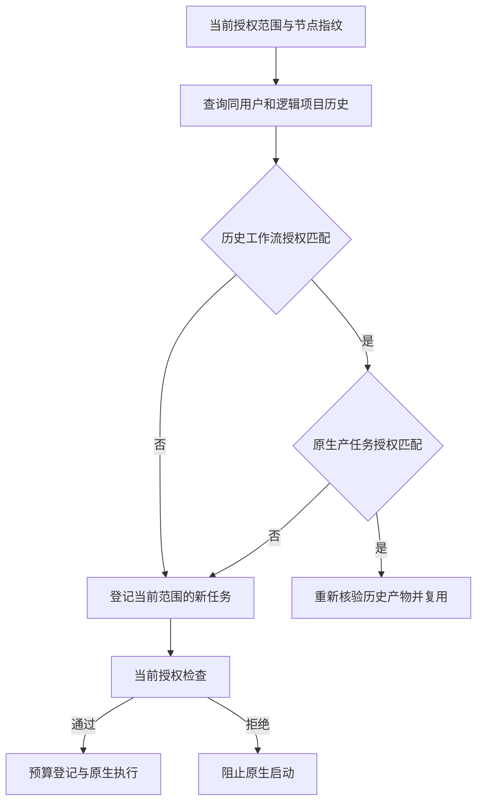

# ArtCraft 授权范围与历史复用架构

OpenSpec AC-TX-001-CACHE、任务 5.11 管理本增量。候选编排运行时 dev.26；旧固定 dev.16 保持不可变。开发版插件 dev.26 是运行时发布检查点，其内置旧技能仍固定 dev.16，更新后的技能与最终插件快照另行发布和验证。

旧查找仅核对所有者、逻辑项目、节点及指纹。新授权修订因此直接复用旧授权任务，绕过该任务的新范围授权检查。现在同时核对历史工作流和原生产任务的 authorizationRef。双重核对拦截历史错误复用记录；同一授权范围的旧指纹与预算记录保持兼容，不通过修改指纹强制重做全部旧工程。

失败测试真实复现五个旧任务被错误复用，新授权范围没有任务启动。最小实现仅修改账本历史查询和调用参数，不改变公共任务、素材或 payload schema。Node 的实际本地子进程 fixture 用于合同验证，不能称为四领域原生验收；公开制品首次安装与新范围原生执行仍需单独验证，当前为 NOT_RUN。

已发布运行时 dev.26 的 Node 回归 87 项中 82 项通过、5 项可选原生／供应商门禁跳过；聚焦工作流 14 项通过，含授权拒绝。旧运行时真实单技能冷启动用例失败（19.499 秒）；候选技能 dev.24 固定 dev.26 后同一原生用例通过（20.006 秒）。五分发包从不可变标签重建，公开 CLI 帮助确认版本 dev.26。当前属于来源技能证据，最终固定插件实际安装门禁仍为 NOT_RUN。[证据](evidence/authorization-reuse.json)。
