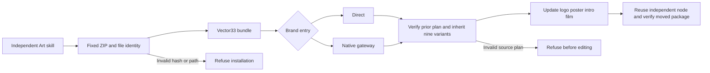

# ArtCraft brand gateway export distribution

All ten independent ArtCraft skills must consume VectorCraft dev.33. Updating the independent VectorCraft plugin does not update ArtCraft's bundled distribution.

## Change and boundaries

Rebuild the complete ZIP from its immutable tag, verify the public archive digest, commit, exact v prefix and file hashes, then synchronize all ten distribution locks and the matching command index. Core runtime113 and other domain contracts are retained. Source88/plugin116 tags remain unchanged; the current source tree is an unpublished candidate.

Both direct swatch.edit and native.command/swatch.edit inherit the verified previous export list when exports is omitted. Explicit empty lists request native-only delivery. The pinned Vector33 pre-install regression covers refusal of a tampered source plan before installation or editing.

## Candidate evidence and remaining work

Each entry completes a real five-node creation, brand revision, repeated request and moved five-child package verification. Nine SVG/PNG/PDF variants over three artboards are delivered; bound preview and consumer pixels change while control-board files remain identical. The direct case compares original whole-tree hashes. The gateway QA filename assumption was corrected and saved-output checks resumed using source manifest hashes, without replaying native edits.

[Candidate evidence](evidence/art-vector33-gateway-export-candidate-20261008.json) covers unpublished source and a warm native cache. Task4.14 still requires immutable publication, actual host installation and ten independent cold first-use runs. Full AC-RT-002 and V1 remain open; insufficient disk space is not acceptance evidence.
