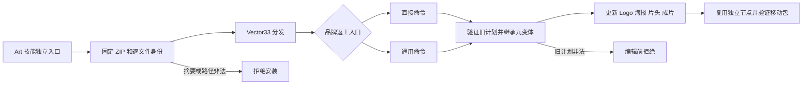

# ArtCraft 品牌网关变体继承分发

ArtCraft 的十个独立技能必须消费 VectorCraft dev.33 的导出继承修复。仅更新独立 VectorCraft 插件不能修复 ArtCraft 内置分发。

## 改动和边界

从 VectorCraft 不可变标签重建完整 ZIP，核对公开发行摘要、提交、精确 v 前缀和逐文件摘要；同步十个分发锁与对应的命令目录。核心仍使用 runtime113，其他领域版本保持现有合同。旧 source88/plugin116 标签保留，当前工作树为未发布候选。

普通 swatch.edit 与 native.command/swatch.edit 省略 exports 时均继承经过完整性核验的旧导出范围；显式空列表保留原生交付语义。旧计划篡改在安装和编辑前拒绝，此边界由锁定 Vector33 的安装前测试覆盖。

## 候选验收与剩余工作

两条入口分别完成真实五节点创作、品牌返工、重复请求及移动后的五子工程包验证。三画板九份 SVG／PNG／PDF 完整交付；关联 PNG 与三个消费节点像素改变，独立画板三种格式字节保持。直接案例保留全源树摘要比较；网关案例在验收脚本编号假设修正后从已保存结果核验源 manifest 摘要，没有重放编辑。

[候选证据](evidence/art-vector33-gateway-export-candidate-20261008.json) 仅覆盖未发布技能源与已有原生缓存。固定发行、实际宿主安装、十独立空缓存首用仍由任务4.14管理；完整AC-RT-002和V1保持开放。磁盘空间不足不构成通过证据。
