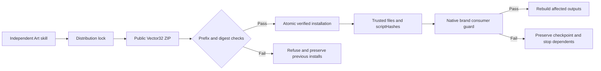

# ArtCraft brand dependency distribution architecture

All ten independent Art skills upgrade their Vector source bundle from dev.31 to immutable dev.32. The engine retains runtime dev.113-runtime.1 and native Vector CLI 0.2.0-craft.2. Art does not adapt Jianying.

## Distribution and trust

The exact public ZIP SHA-256 is `85df4406194bb184eee6635eb6fe9b3d12f8297c3943381be21fe62215a0b831`, commit `1bc3078424be4da3273684fd247329046d565180`, with825 pinned root-relative files. Its prefix is `vectorcraft-skills-v0.1.0-dev.32/`; acceptance requires an exact repository, lock version and URL tag match. Existing root, repository and exact unprefixed-version layouts remain compatible. Mixed roots, traversal, duplicate entries, symlinks, unexpected files and digest mismatches remain rejected.

All13 Vector skills contain `brand_variants.py` with SHA-256 `a600e765e8d2dccbae5c048e70e28e4272844c45fbc0d2eb9d43ca076559daa5`. Setup binds the existing helper into both trusted files and capability scriptHashes, preserving older releases without that helper. Whole-bundle verification rejects injected files; the runtime verifies each registered file. Rebuild the command index from immutable tags after updating the lock, retaining all2,646 domain commands and their identities.

## Behavior and evidence

Before native swatch.edit, the domain saves a checkpoint and records explicit consumers. After editing it checks identities, unrelated properties and artboards. Successful revisions bind brand-dependencies.json and discard temporary checkpoints. Violations preserve checkpoints and stop publication and dependents without automatic replay.

Both missing behaviors were reproduced before implementation. Target tests pass; source regression runs161 tests, with123 passed and38 conditional skips. The stale-index failure and a subsequent disk-full failure are retained; rebuilding the fixed index and recovering space produced a passing regression.

Candidate public ZIP upgrade and five-node native creation, brand revision, reuse and moved-package verification pass using existing Node/core/native caches. This is warm candidate evidence. An initial QA reader used the wrong report nesting; recovery only checked retained results and packaged them, without replaying edits. [Candidate evidence](evidence/art-vector32-guard-candidate-20261008.json). Fixed-release ten-skill cold installation and mixed fault acceptance remain open, as do full AC-RT-002 and V1.
