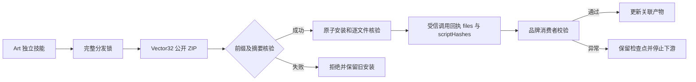

# ArtCraft 品牌依赖保护分发架构

本次将十个独立 ArtCraft 技能的 VectorCraft 捆绑技能源从 dev.31 升级到不可变 dev.32。编排引擎保持固定 runtime dev.113-runtime.1；原生 CLI 为 0.2.0-craft.2。ArtCraft 不适配剪映。

## 分发与信任边界

公开源 ZIP SHA-256 为 `85df4406194bb184eee6635eb6fe9b3d12f8297c3943381be21fe62215a0b831`，提交 `1bc3078424be4da3273684fd247329046d565180`。825 个根相对文件全部固定。归档前缀为 `vectorcraft-skills-v0.1.0-dev.32/`；仅当仓库、锁版本、URL 的 v 标签完全匹配时接受。旧的无前缀、仓库名及不带 v 的精确版本前缀保持兼容。混合根、逃逸、重复项、符号链接、未知文件、摘要不符仍拒绝。

所有十三个 Vector 技能均包含相同 `brand_variants.py`，摘要 `a600e765e8d2dccbae5c048e70e28e4272844c45fbc0d2eb9d43ca076559daa5`。Art 安装器将实际存在的该模块同时登记到受信 files 与能力快照 scriptHashes，旧发行不含此文件时仍兼容。完整包验证防止文件被注入；运行器验证回执清单中的每个文件。命令索引必须从固定标签重建，继续绑定四领域 2,646 条命令，不能只替换分发锁。

## 可观察行为和验证

原生 swatch.edit 前保存检查点并记录显式消费者，后检查对象身份、非消费者属性及画板。正常返工生成摘要绑定的 brand-dependencies.json，清除临时检查点；异常保全检查点并阻止发布与下游执行，禁止自动重放。

已先复现前缀拒绝和受信回执遗漏，再修复；目标测试通过。源码回归 161 项，123 通过、38 条件跳过。一次索引未同步失败和一次磁盘满失败均保留；重建固定索引、环境恢复后回归通过。

候选实际公开 ZIP 升级及五节点原生混合创建／返工／复用／移动验包通过，使用已有 Node、核心与原生缓存，属于暖缓存候选验证。QA 报告检查起初误读 checks 内字段，修正后仅恢复检查与打包，未重放编辑。[候选证据](evidence/art-vector32-guard-candidate-20261008.json)。固定发行的十技能冷安装及错误注入混合验收仍开放，不关闭完整 AC-RT-002 或首版验收。

## 固定发行验收

source88／plugin116 的十项独立公开冷安装（所选 Vector）、64 摘要、五节点原生混合返工／移动交付和两类真实非消费者误改验证通过。校验阻断下游，保全可重开检查点且不重放；检查点原生内容仅保存时间戳可合法变化。维护分支重建工具另补精确 v 前缀，负例与五包字节重建通过；116不可变工具保留旧限制，不改标签或产品字节。完整 AC-RT-002 与首版仍开放。[固定证据](evidence/craft-art116-brand-guard-fixed-first-use-20261008.json)。
