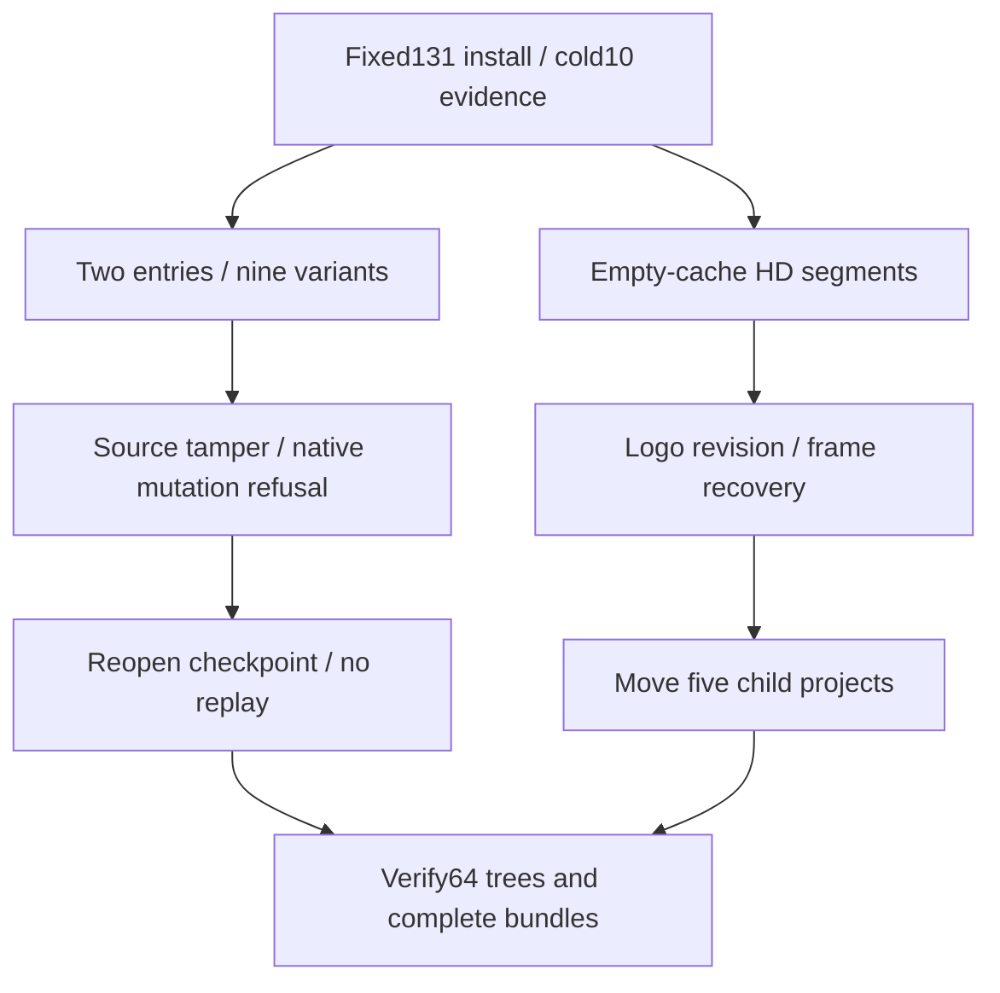

# ArtCraft Brand and Segmented Delivery Acceptance Architecture

This acceptance covers three named AC-RT-002 scenarios: BRAND-GUARD, GATEWAY-EXPORT and SEGMENT-GUIDE. Tests use actual installed plugin131/source103/runtime130. Domain packages and published code remain unchanged. The existing ten independent cold first uses apply to these exact immutable trees; all64 host trees, complete domain bundles and35 core files are rehashed after use.

Both swatch.edit and native.command/swatch.edit revise native sources while omitting exports. Each inherits nine SVG/PNG/PDF renditions across three artboards, updates associated pixels and downstream poster/motion/video, preserves the control artboard byte-for-byte and reuses the independent node. Original deliveries survive and five child projects verify after relocation. Separate explicit exports: [] tests produce native-only delivery through both entries. Old source-plan tampering is rejected before native editing; this does not establish refusal before outer Art bootstrap.

A QA-only Session hook performs an actual unbound-object paint edit after native swatch.edit. The installed parent runtime and Vector33 detect the mutation, retain the original failed stage and brand checkpoint, block consumers and preserve task/budget identity on repetition without replay. Public commands reopen the checkpoint. brand_variants.py is bound in both files and scriptHashes. The installed parent factory rejects missing or drifted helpers in QA skill copies; original installation bytes are preserved.

The HD case begins with an empty runtime, system PATH and default public downloads. It delivers1920×1080,24fps,120frames and four transparent sequence segments. All source frames are verified;120 film frames are independently decoded and hashed, with three oracle frames retained for eight composite pixel checks. Logo revision updates four dependent outputs while reusing the independent node and preserving voice/background/original deliveries. A corrupt frame is rejected; restoring original bytes reuses the same tasks, followed by five-project portable delivery verification.

The first HD attempt failed in QA logging after successful creation: binary ffprobe output was passed to write_text. Its driver/log/output remain preserved. A byte-safe recorder resumes the same delivery without repeating initial native creation. Every retained call/output digest is rechecked. This QA failure is not a product regression.

[Current evidence](evidence/current-brand-segment-acceptance131-20261009.json) and the [scenario audit](evidence/runtime-upgrade-scenario-audit131-20261009.json) bind each named contract. Task4.6 stays open:12/14 scenarios have evidence,5 from current installed acceptance and7 from explicitly justified unchanged-code reuse. Generic positive/negative capability-mode contracts remain open. Actual Skills CLI installation, GUI/model/creative approval, other platforms, formalV1 and marketplace publication are excluded. Twelve numbered tasks remain open.
