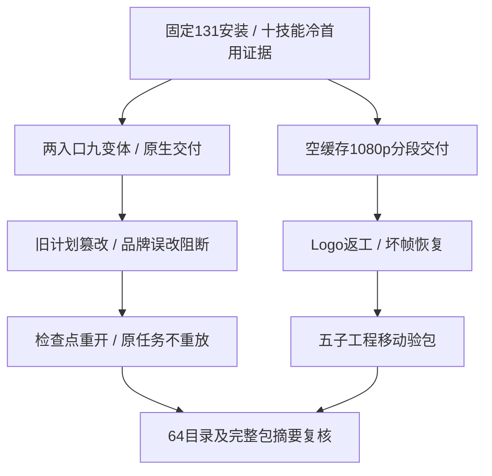

# ArtCraft 品牌与分段交付验收架构

本次补验对应 OpenSpec AC-RT-002 的 BRAND-GUARD、GATEWAY-EXPORT、SEGMENT-GUIDE 三个具名场景。使用已发布插件131／技能源103／运行时130的实际安装副本；不修改领域包，不重新发布代码。固定十技能冷首用使用同一不可变树已通过的证据；本次重新核验全部64宿主目录、四领域全部包文件及35核心文件。

品牌用例分别通过 swatch.edit 与 native.command/swatch.edit 修改真实原生工程。两入口均省略 exports，继承三个画板的九份 SVG／PNG／PDF；关联像素与海报／动画／视频更新，无关画板三种格式字节不变，独立节点复用，原交付保全。移动包验证五个子工程。显式 exports: [] 两入口另行验收，仅输出原生工程。篡改旧计划在新原生编辑前被拒绝，不把该结果解释为 Art bootstrap 前校验。

品牌错误路径使用加载期 QA Session 钩子，在真实 swatch.edit 后额外改动未绑定对象。实际固定父运行时与 Vector33 识别误改并保存原始失败暂存／品牌检查点；下游阻断，同计划重复保留原任务与预算，不重放编辑。检查点由公开命令重开。受信 brand_variants.py 同时进入 files 与 scriptHashes；复制技能中的缺失／摘要漂移被实际安装父工厂拒绝，原安装字节保持不变。钩子和副本变化仅属于 QA。

分段用例从空运行时、系统 PATH、默认公开下载开始，生成1920×1080／24fps／120帧和四段透明序列。全部源帧逐项核验，成片120帧独立解码并摘要，三帧保留用于八项合成像素检查。替换Logo更新四个依赖产物，独立节点复用，配音、背景和旧交付保持不变。坏帧拒绝、恢复原字节后同任务复用，五子工程迁移验证通过。

首轮高清用例在创作成功后发生 QA 日志记录类型错误：ffprobe 返回 bytes，记录器使用 write_text。原日志、首次输出及驱动保留，修正二进制记录后从同一交付继续，未重复首次原生创作。最终原始调用和输出摘要均复核；不将此 QA 错误当作产品红灯。

[当前证据](evidence/current-brand-segment-acceptance131-20261009.json)与[场景审计](evidence/runtime-upgrade-scenario-audit131-20261009.json)共同记录具名条款。4.6仍开放：14场景中12项有证据，5项当前固定安装、7项相关代码不变而复用；通用能力／模式的正负合同仍待完整验收。实际 Skills CLI、GUI、模型创作、其他平台、正式V1与市场发布不在本次通过范围；12个编号任务仍开放。
