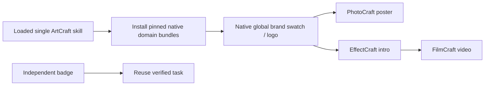

# ArtCraft native brand token mixed workflow architecture

## 1. Authority and versions

OpenSpec AC-SK-003-BRAND and task 3.17 govern this addition. Published skill source dev.20 pins VectorCraft skills dev.6. The ArtCraft orchestration runtime remains dev.16 and VectorCraft native CLI remains 0.2.0. Public scripts and payload schemas remain compatible. The upstream desktop application is research material, not this runtime's command authority.

## 2. Installation and execution

Each of ten independent skills contains its own example, guide, installer and locked distribution manifest. The published VectorCraft skills archive is rebuilt from immutable source tag v0.1.0-dev.6, SHA-bound at archive and file level. No sibling skill or plugin-private path is required. Existing immutable cache entries remain separate from the new version.

## 3. Native revision and dependencies

The revised logo references its original artifact and independently supplied native project SHA, opens that project and edits the registered global RGB swatch. Its original export inventory is inherited only after digest verification. The explicit DAG changes consumers' input fingerprints, so poster, intro and film produce new native deliverables. The independent badge task is reused. Prior projects, output bytes and supplied audio remain unchanged. Identical revision replay reuses verified tasks and budget.

Consumers in this example are generated from their prior plans. Preserving additional hand edits inside a consumer requires registering that consumer's source project and a supported domain-local edit. This example does not imply those unregistered edits survive regeneration.

## 4. Verification and packaging

The old locked skill bundle fails the native logo step and blocks its consumers while the independent badge succeeds. With dev.6, a single copied ArtCraft revise skill and fresh public runtime cache pass in 48.357 seconds. Checks bind installed VectorCraft version, changed four outputs and decoded poster/intro/film pixels, byte-identical independent logo icon, all prior files, original audio, repeat task identity/budget and five verified packaged child projects.

Default regression: 57 tests, 46 pass and 11 native/offline gated skips, 5.550 seconds. Bounded cold native testing is separate from this regression. Skill source dev.20 is published. Plugin dev.22 is published. Fixed-release host discovery passes for all 58 skills; a separate installed-skill cold native run passes both tests in 54.471 seconds. All installed hashes remain unchanged, and all five distribution archives reproduce the pinned bytes. Evidence: docs/evidence/brand-token-mixed-first-use.json.

## 5. Boundaries

RGB native global swatches and explicit registered DAG consumers are covered. Automatic model design, undeclared cross-file dependency discovery, other color models, cross-editor editable token preservation, GUI, speech quality and human creative acceptance are not claimed. The synthetic test audio is an input fixture, not narrated speech. review_ready means pending review, not acceptance.

## 6. VectorCraft dev.7 dependency update

Skill candidate dev.21 pins the immutable VectorCraft dev.7 archive (202 files) and uses bundled Source Sans 3 for the Vector sample. ArtCraft runtime remains dev.16. Native loaded-font availability is not an OS-wide font inventory; user fonts are not silently replaced. Task 3.19 / AC-SK-003-BRAND-FONT records this compatibility gate.

A single copied revise skill with fresh public downloads passes two contract/native tests in 56.437 seconds. The five native projects, selective four-output update, independent badge reuse, unchanged originals, idempotency and five-child package verification pass. Default regression: 57 tests, 46 passed and 11 skipped in 6.123 seconds. All five distribution archives reconstruct to locked hashes. Fixed-host installed verification of this candidate is NOT_RUN; previous dev.22 host results apply only to their original frozen release. Evidence: docs/evidence/vector-font-mixed-first-use.json.
