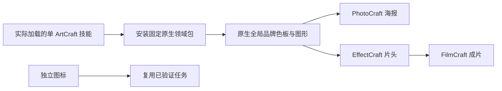

# ArtCraft 原生品牌色混合工作流架构

## 1. 规范与版本

沿用 OpenSpec AC-SK-003-BRAND 与任务 3.17。已发布技能源 dev.20 固定 VectorCraft 技能 dev.6；ArtCraft 编排运行时保持 dev.16，VectorCraft 原生 CLI 保持 0.2.0。公开脚本与 payload 合同兼容。上游桌面应用是研究来源，本项目编排运行时拥有自己的命令事实源。

## 2. 安装与执行

十个独立技能均自带示例、指南、安装器和固定分发锁。VectorCraft 发布 ZIP 从不可变 v0.1.0-dev.6 源标签构建，同时校验整个归档与逐文件摘要。无需兄弟技能或插件私有路径，新版本与旧缓存分离。

## 3. 原生修订与依赖

图形修订登记旧产物与单独提供的原生工程摘要，打开原工程并修改已关联 RGB 全局色板；原导出清单必须先通过摘要校验才能继承。明确 DAG 消费者的输入版本变化，触发海报、片头和成片的新原生交付。独立 badge 节点复用。旧工程、旧输出与输入音频字节保持不变；重复相同修订复用任务及预算。

本示例的消费者按照已有计划重新生成。若用户在消费者工程内另有未登记手工编辑，应明确登记其源工程并执行该领域支持的局部操作；本示例不保证重新生成会保留这些未纳入计划的修改。

## 4. 验证与打包

旧固定包在原生图形步骤失败，消费者阻塞，独立图标成功。升级 dev.6 后，单独复制 ArtCraft revise 技能，使用默认在线全新缓存，在 48.357 秒通过：绑定实际安装的 VectorCraft 版本，四个关联输出改变，海报／片头／成片解码像素改变，独立图标 PNG、全部旧文件与输入音频不变；重复任务身份与预算不变，五子工程打包可验证。

默认回归 57 项，46 项通过、11 项原生／离线门禁跳过，耗时 5.550 秒。真实冷启动另行执行，不能用默认回归代替。技能源 dev.20 已发布；插件 dev.22 已发布；固定发行版宿主发现 58 个技能通过，安装后单技能全新在线原生复验 2 项通过，耗时 54.471 秒。全部安装摘要不变，五个分发包按固定标签重建与锁一致。证据：docs/evidence/brand-token-mixed-first-use.json。

## 5. 边界

覆盖原生 RGB 全局色板与明确登记 DAG 消费者；不推断模型自动设计、未登记跨文件依赖发现、其他颜色模型、外部编辑器可编辑 token 保真、GUI、声音质量或人工创作接受。测试音频是合成输入 fixture，不是配音。review_ready 表示等待审阅。

## 6. VectorCraft dev.7 依赖更新

技能候选 dev.21 固定 VectorCraft dev.7 不可变发布包（202 个文件），矢量示例明确使用随运行时提供的 Source Sans 3。ArtCraft 运行时保持 dev.16。原生已加载字体报告不代表全操作系统字体目录，不静默替换用户字体。任务 3.19 / AC-SK-003-BRAND-FONT 记录本次兼容门禁。

单独复制返工技能并从全新缓存公开下载，两项契约与原生测试在 56.437 秒通过：五个原生工程、四个关联产物更新、独立图标复用、旧文件保留、重复修订幂等和五子工程打包验证。默认回归 57 项，46 项通过、11 项跳过，耗时 6.123 秒。五个分发包从不可变标签重建且与锁一致。当前候选固定宿主安装验收为 NOT_RUN；旧 dev.22 宿主结果仅证明原固定版本。证据：docs/evidence/vector-font-mixed-first-use.json。

已发布技能 dev.21／插件 dev.23 的固定安装复验通过：5 个插件、58 个技能、零加载错误。实际安装的返工技能单独复制，使用全新公开原生缓存和默认 Python 3.14.3，两项契约与原生测试在 54.673 秒通过。全部 58 个安装技能摘要不变。上文候选 NOT_RUN 描述发布前检查点。证据：docs/evidence/codex-release25-vector-font-mixed-20261006.json。
