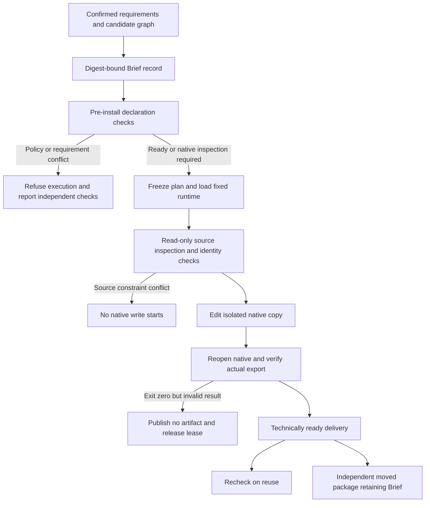

# ArtCraft Mixed Brief Acceptance Architecture

Status: AC-DM-001 implementation and all seven current named scenarios are verified. Tasks 6.1/6.2/6.3 are complete; full V1 and 28 other tasks remain open. The authority is OpenSpec `establish-v1-plugin/specs/domain-workflow/spec.md`, which remains unarchived. Earlier references to eight scenarios were a counting error. The actual P, N, BRIEF, TIME, SOURCE-FILM, SOURCE-DESIGN and SAVED scenarios are all accounted for; no requirement was removed.

Versions: Art plugin126, independent source98 and runtime126-runtime.1. Domain identities come from `host-acceptance-art126.lock.json`. All 33 loaded runtime files match current source, all64 installed host skill trees match, and all four copied domain-use trees match. This is a tests/documentation change and reuses existing immutable prereleases.



| Scenario | Implementation and evidence |
|---|---|
| P | Both Brief validators and the workflow bind revision, dimensions, brand/subjects/fonts, budget and native format; the installed skill delivers four domains, reuses tasks and packages results. |
| N | Upload prohibition blocks cloud execution while independent local checks remain visible. The isolated runtime is absent, with no tasks or media; only an empty project write-lock remains. |
| BRIEF | Public CLI creates, moves and verifies the record. Frozen and portable plans retain the exact Brief. Eight installed refusal cases cover font, subject reference, format, budget, authority, ambiguity, upload and tampered record. Existing unit tests cover closed fields, overwrite refusal, frozen revisions, legacy compatibility and selective constraints. |
| TIME | Shared cases check exact ticks and long audio. Real native/save/export/reuse gates cover Film; a moved source duration violation exits0 but publishes nothing. |
| SOURCE-FILM | Real subtitle revision, reuse and replacement; wrong source dimensions prevent native execution, unknown duration changes pass through saved-output gates, and source hashes stay unchanged. |
| SOURCE-DESIGN | Real Photo/Effect/Vector source inspection, reuse, resizing and extra board; parser tests cover invalid identities and numbers, without claiming actual invalid native responses were executed. |
| SAVED | All three design domains have real exit0/result-mismatch refusals. Actual PNG dimensions, fixed Effect in-memory import probes, Film one-frame tolerance and cache rechecks have their respective tests/results. |

Implementation locations: `src/planning/project_brief.ts`, `workflow_engine.ts`, `native_brief_output.ts`, `film_duration.ts`, `src/adapters/public_skill.ts`, source/export parsers and `src/artifacts/project_package.ts`; standalone `brief.py`/`workflow.py` own record and pre-install boundaries. See [fixed evidence](evidence/brief-native-fixed126-20261008.json) for file hashes and exact scenario mappings.

Separate results: one full native mixed test passed in20.958s; one fixed installed public-entry test passed in9.526s. Default skill regression:184 total,137 passed,47 conditional skips. The unchanged runtime regression remains299 total,278 passed,21 skips from the previous evidence; the full native test was run again now. The native ledger contains27 ready tasks,4 saved-output failures and4 source-inspection-blocked planned tasks. All four failed native processes exited0 and have confirmed stop evidence without published outputs. The four planned source checks have no execution; leases are zero.

Two fixture failures are retained: the independent node accidentally copied artboard.new and correctly required native inspection; a second assertion incorrectly required the empty project lock directory to be absent after refusal. No product fix or product RED is claimed. The direct adapter test retains a legacy logical pluginVersion0.1.0 fixture; actual skill trees, CLI versions and binary hashes are checked separately against the fixed lock. The installed public entry uses real released identities.

Run from the standalone skills repository with explicitly verified installed skill and runtime cache paths and a new isolated output directory. The test installs no tools and does not claim cold startup:

```sh
CRAFT_NATIVE_BRIEF_ACCEPTANCE=1 \
CRAFT_NATIVE_BRIEF_ROOT="$ISOLATED_ACCEPTANCE_ROOT" \
CRAFT_NATIVE_BRIEF_SKILL="$INSTALLED_ARTCRAFT_EXECUTE_SKILL" \
CRAFT_NATIVE_BRIEF_RUNTIME="$VERIFIED_CRAFT_RUNTIME_CACHE" \
python3 -I -B -m unittest discover -s tests -p test_native_brief_acceptance.py -v
```

Boundaries: macOS arm64, fixed releases, verified warm caches and programmatic samples. Historical host discovery/cold-install evidence is reused only after full identity checks. No fresh model dispatch, GUI, creative approval, other-platform or generic Skills CLI acceptance is claimed. Other-domain source drift remains outside this change; no global working-tree audit PASS is claimed. Seven-scenario completion does not complete other requirements or full V1.
