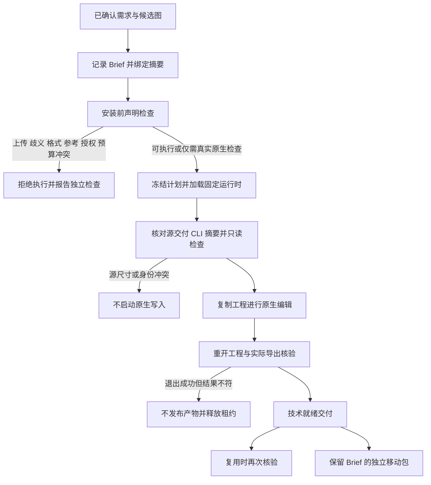

# ArtCraft 混合需求验收架构

当前状态：AC-DM-001 实现和当前七个命名场景验收完成，任务 6.1／6.2／6.3 已完成；完整 V1 与其他计划仍开放。事实源为 OpenSpec `establish-v1-plugin/specs/domain-workflow/spec.md`，未归档。此前提到“八场景”是计数错误；本次逐项核对实际的 P、N、BRIEF、TIME、SOURCE-FILM、SOURCE-DESIGN、SAVED 七个场景，没有删减规格。

固定版本为 Art 插件 126、独立技能源 98、运行时 126-runtime.1。领域固定版本来自 `host-acceptance-art126.lock.json`。33 个实际加载的运行时文件与当前源码、64 个宿主安装技能树，以及四份原生适配器测试技能副本均核对一致。本次只增加测试与文档，沿用已有不可变预发布制品。



| 规格场景 | 实现及证据 |
|---|---|
| P | 版本化需求、画幅、品牌／角色／字体、预算和原生格式由两侧 Brief 校验与工作流绑定；安装技能实际完成四领域交付、复用、打包。 |
| N | 禁止上传与云执行冲突时拒绝；只读检查仍报告独立本地节点通过。实际独立空运行时未创建，无任务或媒体输出，仅保留项目目录的空写入锁。 |
| BRIEF | 实际公开 CLI 创建、移动并核验摘要记录；冻结计划和移动包保留相同 Brief。字体、主体引用、格式、预算、授权、歧义、上传和记录篡改共八类真实入口拒绝。闭合字段、覆盖拒绝、修订冻结、无 Brief 兼容及选择性约束由现有单元测试覆盖。 |
| TIME | 共同声明样本验证精确 ticks 与长音轨；原生混合测试验证实际保存工程、成片 probe、帧率及复用。移动 Film 源工程后的时长违规在原生退出 0 后被拒绝，无发布产物。 |
| SOURCE-FILM | 真实字幕修订、复用、片段替换；只读源尺寸不符阻止原生执行，未知时长操作经过保存后门禁，原始源文件摘要保持一致。 |
| SOURCE-DESIGN | Photo／Effect／Vector 真实源检查、复用、调整尺寸、新画板；对应画板／合成身份与无效数值拒绝由解析器测试补证，不伪称执行了无效原生响应。 |
| SAVED | 三个设计领域均有原生退出 0、实际保存结果不符而拒绝发布的例子；PNG、Effect 固定 CLI 内存导入探测、Film 成片一帧容差和缓存重新核验均有对应测试或实际结果。 |

可定位实现为 `src/planning/project_brief.ts`、`workflow_engine.ts`、`native_brief_output.ts`、`film_duration.ts`、`src/adapters/public_skill.ts`、三个源／导出解析器和 `src/artifacts/project_package.ts`；独立技能源的 `brief.py` 与 `workflow.py` 负责记录和安装前边界。具体文件摘要与逐场景映射见 [固定证据](evidence/brief-native-fixed126-20261008.json)。

运行证据分开记录：完整原生混合测试 1 项通过，20.958 秒；固定安装公开入口测试 1 项通过，9.526 秒；技能源默认回归 184 项中 137 通过、47 条件跳过。前一轮未变化的运行时 299 项中 278 通过、21 跳过沿用原证据，并另行运行当前完整原生测试。原生适配器账本有 27 个技术就绪任务、4 个保存后拒绝任务、4 个源检查阻塞任务；4 个失败任务的原生进程均退出 0 且停止已确认，输出不发布；4 个 planned 源检查任务没有 execution，租约为 0。

第一次独立检查夹具误复制 `artboard.new`，该节点正确要求原生输出检查；第二次夹具错误要求拒绝后连写入锁目录都不存在。两次失败日志保留，本次没有产品代码修复，也不把它们记录成产品 RED。原生适配器测试沿用历史逻辑 `pluginVersion=0.1.0` 测试身份；实际技能树、CLI 版本及二进制摘要由固定锁单独核对，安装公开入口使用实际发布身份。

复验时从独立技能源仓库运行，显式设置已核对的安装技能目录、隔离输出目录和固定运行时缓存；测试不安装工具，不宣称冷启动：

```sh
CRAFT_NATIVE_BRIEF_ACCEPTANCE=1 \
CRAFT_NATIVE_BRIEF_ROOT="$ISOLATED_ACCEPTANCE_ROOT" \
CRAFT_NATIVE_BRIEF_SKILL="$INSTALLED_ARTCRAFT_EXECUTE_SKILL" \
CRAFT_NATIVE_BRIEF_RUNTIME="$VERIFIED_CRAFT_RUNTIME_CACHE" \
python3 -I -B -m unittest discover -s tests -p test_native_brief_acceptance.py -v
```

边界：macOS arm64、固定发布、经核验的温缓存、程序化样本。历史宿主发现与冷安装证明仅在完整摘要一致后复用，本次没有重新做模型调度、GUI、人工创作批准、其他平台或通用 Skills CLI 安装。其他领域工作区的源漂移未改动，也没有把全工作区源码审计写成通过。以上七场景完成不代表其他规格或完整 V1 完成。
