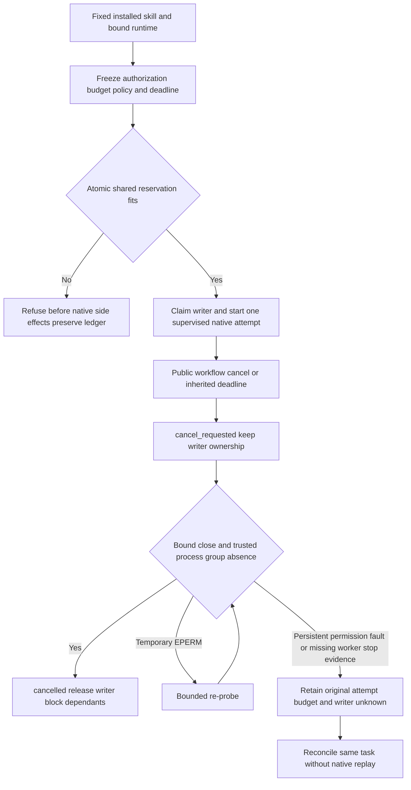

# ArtCraft Budget and Cancellation Acceptance Architecture

> Scope: AC-TX-003 acceptance on fixed plugin127/source99/runtime126; task5.9 only.
> Version: 1.0.0 · Updated: 2026-10-09

## 1. Authority and decision

The plugin OpenSpec task-execution specification remains authoritative. This acceptance distinguishes public installed native execution from controlled SQLite/process fault tests. Both layers are needed: current local adapters have zero monetary/external cost, so shared nonzero allocations are exercised by trusted-adapter fixtures without contacting paid services. Human acceptance, GUI and complete V1 are separate gates.

## 2. Execution and failure paths

## 3. Scenario-to-evidence matrix

| Scenario | Observable behavior | Evidence layer |
|---|---|---|
| AC-TX-003-P | Fixed runtime, original task/attempt, cancellation and budget receipts remain bound | Installed recover skill, actual Vector create and Effect render |
| AC-TX-003-N | Public parent-workflow cancel returns intent; one actual render stops before settlement; no consumer task | Installed manual-cancel case, durable event order and stopped execution |
| AC-TX-003-B | Siblings and two OS processes cannot exceed a common cap; unsafe/missing usage and overflow fail before allocation | Current shared_budget/local_runner controlled trusted-adapter tests with real SQLite/processes |
| AC-TX-003-R | Same revision does not allocate twice; policy cannot be raised; revision exhaustion is stable; unknown execution retains reservation and ownership | Installed quota refusals, current native worker SIGKILL and two waiting recoveries, SQLite reopen and legacy-history tests |
| AC-TX-003-PROBE | Transient post-close EPERM is re-probed; persistent EPERM leaves writer ownership unknown | Two new real supervised-process tests with explicit probe-error injection; process_group boundary tests |
| AC-TX-003-SIGNAL | ESRCH is not sufficient stop evidence; EPERM signal error stays unknown; no second spawn or budget reset | Current LocalRunner controlled-signal tests; actual manual/deadline termination tested independently |

Injected errors are controlled test faults, not claims that macOS naturally produced a permission or signal race. Worker SIGKILL targets only the owned supervision worker. The native process and outputs exist, but test-only observation of process disappearance cannot create ledger stop evidence.

## 4. Public installed execution

`tests/test_budget_cancel_installed.py` in artcraft-skills runs a single copied fixed installed recovery skill with an existing verified cache. It creates a Vector project, refuses two exhausted revisions and a raised budget policy without changing any ledger table, then observes actual Effect renders for manual cancel and a four-second execution deadline. Both cases keep the attempt and budget, stop before releasing ownership, block the consumer and do not replay on repeated workflow calls. Partial native files after cancellation remain preserved; they are not accepted deliveries.

The separate `test_worker_crash_first_use.py` run uses an empty cache and public pinned downloads, kills only its owned worker after native spawn, and requires two structured waiting receipts with the same attempt, budget, writer lease and original files. Its receipt binds runtime version, installation-receipt hash, native runtime identity, request hash and test driver hash. It does not authorize automatic settlement or replay.

## 5. Verification and distribution

Evidence: [budget/cancel matrix](evidence/budget-cancel-complete-fixed127-20261009.json). Current runtime regression: 303 total, 282 passed and 21 conditional skips. The two additional post-close permission-probe tests pass. Source regression: 201 total, 149 passed and 52 conditional skips; the two newly added installed acceptance drivers are run separately and pass. All 64 installed host skill trees and all runtime source modules/package identity were rechecked. Production skills/runtime bytes and immutable plugin127/source99 ZIP assets remain unchanged.

Task5.9 is complete for the six named scenarios above. Fourteen numbered tasks remain. Full source-workspace auditing still refuses the four domain repositories' tracked-source drift; that independent refusal is preserved. No generic Skills CLI installation or new host/platform qualification is claimed.

## 6. Related version-binding result and limits

The current installed revision skill also creates eight native outputs across four domains, refuses frozen plan/authorization/input/actual Python-launcher changes while preserving every project file and ledger table, reuses same-scope producers and creates new-scope tasks, then verifies a moved four-child package. See [version-binding evidence](evidence/version-binding-fixed127-20261009.json). This narrows current implementation uncertainty but does not close task5.3: actual GUI modification followed by the exact stale-plan revision_conflict response remains unobserved. The desktop automation entry failed initialization, and filesystem fixtures do not substitute for that gate.
