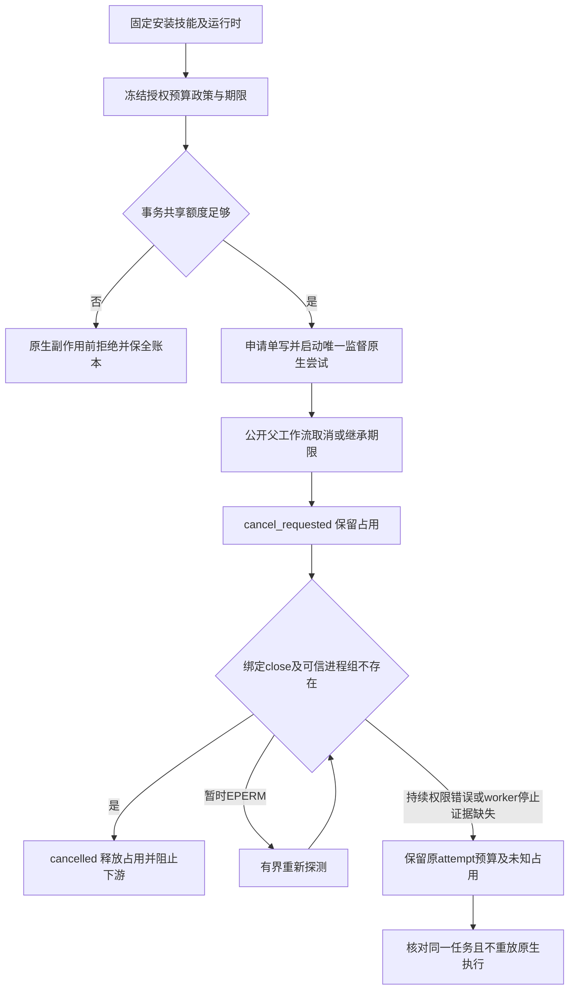

# ArtCraft 预算与取消验收架构

> 范围：固定插件127／源99／runtime126的AC-TX-003验收，仅关闭任务5.9。
> 版本：1.0.0 · 更新：2026-10-09

## 1. 事实源与判断

插件OpenSpec task-execution规范仍是唯一行为事实源。本次区分已安装公开入口的真实原生执行与受控SQLite／进程故障测试。两个证据层均需保留：当前本地适配器金钱及外部调用成本为零，非零共享额度使用可信适配器fixture测试，不调用付费服务。人工接受、GUI及完整V1分别验收。

## 2. 执行与失败路径

## 3. 规范场景与证据

| 场景 | 可观察行为 | 证据层 |
|---|---|---|
| AC-TX-003-P | 绑定固定运行时、原任务／attempt、取消及预算回执 | 安装恢复技能的真实Vector创建及Effect渲染 |
| AC-TX-003-N | 父工作流公开取消先返回意图，真实渲染停止后才收敛，下游没有任务 | 安装副本主动取消、持久事件顺序及停止记录 |
| AC-TX-003-B | 兄弟及两个OS进程不能超出共同额度；缺失／非法消耗与溢出不分配额度 | 当前shared_budget／local_runner的可信适配器受控测试，真实SQLite及进程 |
| AC-TX-003-R | 同修订不重复占用；政策不可提高；耗尽拒绝稳定；未知执行保留额度及占用 | 当前安装额度拒绝、原生worker SIGKILL及两次等待恢复、账本重开与历史预算测试 |
| AC-TX-003-PROBE | close后暂时EPERM继续核对，持续EPERM保留未知单写 | 两项新增真实监督子进程测试，明确注入探测错误；process_group边界测试 |
| AC-TX-003-SIGNAL | ESRCH不能单独证明停止，发信号EPERM保留未知，不增加启动或重置预算 | 当前LocalRunner受控信号测试；主动取消／期限终止另有实际原生证据 |

错误注入是受控故障，不能声称macOS自然发生了权限或信号竞态。worker SIGKILL只针对测试创建的监督进程；原生进程及产物存在，测试观察到组消失也不能伪造账本停止证据。

## 4. 实际安装执行

artcraft-skills的`tests/test_budget_cancel_installed.py`独立复制固定安装的恢复技能，复用已核验缓存。真实Vector创建后两次耗尽拒绝与提高预算政策拒绝均保全全部账本表；随后观察Effect原生渲染并分别主动取消及设置四秒执行期限。两者保留attempt与预算，停止后才释放占用，下游不启动，重复工作流不重放。取消后的部分原生文件保留，不能当作成功交付。

另行执行`test_worker_crash_first_use.py`：空缓存公开下载固定依赖，原生启动后只杀本测试的worker，两次恢复均要求结构化等待回执，原attempt、预算、租约及文件不变。回执绑定运行时版本、安装回执摘要、原生身份、请求摘要和测试驱动摘要；不授权自动收敛或重放。

## 5. 验证与分发

证据：[预算与取消矩阵](evidence/budget-cancel-complete-fixed127-20261009.json)。当前运行时回归303项：282通过、21条件跳过；新增两项close后权限探测测试通过。技能源回归201项：149通过、52条件跳过；新增两个安装验收驱动另行实际执行通过。重新核对全部64项宿主技能整树及全部运行时源码模块／包身份。生产技能与运行时字节、插件127／源99的不可变ZIP保持不变。

任务5.9的上述六个规范场景已验收，剩余14项编号任务。全工作区源码审计仍拒绝四领域仓库的跟踪源漂移；保留这一独立拒绝，不宣称实际通用Skills CLI安装或新增宿主／平台资格。

## 6. 版本绑定进展与限制

当前固定安装修订技能另行生成四领域共8个原生交付；冻结计划、授权、输入、实际Python启动身份变化均被拒绝，所有项目文件及账本表保全；同授权复用原任务，新授权产生自己的任务，四子工程移动包核验通过。见[版本绑定证据](evidence/version-binding-fixed127-20261009.json)。这补齐当前实现证据，但不关闭5.3：实际GUI改动后精确旧计划revision_conflict全过程仍未观察。桌面自动化入口初始化失败，不用文件fixture替代GUI门禁。
