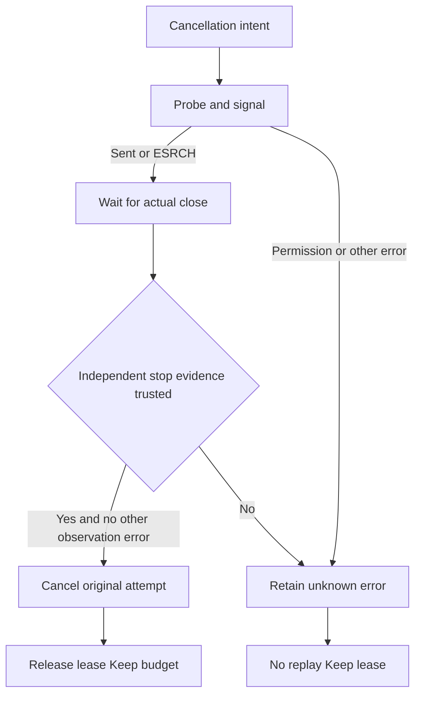

# ArtCraft cancellation signal exit race

Contract: AC-TX-003-SIGNAL; task5.19. Fixed runtime122-runtime.1/source94/plugin122 now qualifies this bounded task; see the fixed evidence below. The earlier intermittent parallel parent-cancellation failure did not reproduce on this turn's first rerun, so its cause is not attributed to this patch.

A process group may exit between its existence probe and SIGTERM/SIGKILL. Previously, ESRCH from the signal was retained as an observation failure even after actual close and independent group-stop confirmation, leaving cancellation and writer ownership pending.

The internal signalGroup absorbs only ESRCH. Its return is never stop evidence. The worker still requires actual close, bounded independent probes and the original token/epoch. EPERM, other signal errors, unknown probes and live groups preserve unknown state and the lease. There is no added execution or retry authority.

The controlled real-process RED records groupStopped=false/outcome_unknown after injected ESRCH following actual SIGTERM; GREEN settles only after trusted close/stop. A live-group case retains ownership before close despite ESRCH, and a permission-error case refuses settlement even after close. A test-owned Node preload injects errors only into its own launch chain; pinned skill bytes stay unchanged. This is not an observed natural OS race.

Thirty runner/process-group tests pass. Both complete parallel and serial suites pass227 of247 tests, with20 conditional skips. Fixed installed native rendering, first use, host discovery and full-contract acceptance remain separate. Complete task5.9 and V1 stay open.

Real native RED from fixed121/runtime113 and candidate GREEN with public runtime122-runtime.1 pass the controlled Effect render injection test. [Evidence](evidence/cancel-signal-candidate-20261008.json). Installed new-plugin qualification remains pending.

Fixed bounded task5.19 qualification: [evidence](evidence/craft-art122-cancel-signal-fixed-first-use-20261008.json). Complete5.9/V1 remain open.
