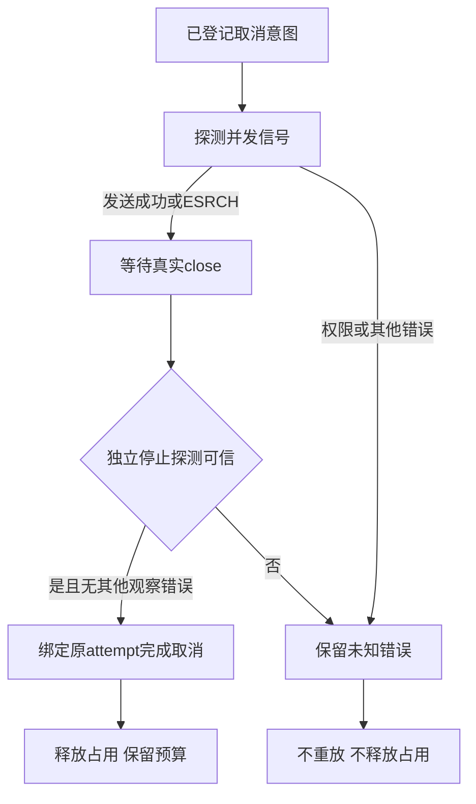

# ArtCraft 取消信号退出竞态

规格：AC-TX-003-SIGNAL；任务5.19。当前为候选；固定运行时与独立技能安装复验完成前保持开放。上轮并行父取消偶发失败本轮首次复跑未复现，不能断言与本修复同因。

监督器先探测进程组，再发送SIGTERM或SIGKILL，两个系统调用之间进程组可能退出。原实现会把发送返回的ESRCH记录为观察失败，即使之后已有真实close与组停止证据，仍永久保留cancel_requested和工程占用。

新增内部signalGroup只吸收ESRCH；该返回值本身不作为停止证明。监督器仍等待真实close、有界独立探测及原任务token／epoch绑定。EPERM、其他信号错误、未知探测和未停止组仍保留未知与租约。没有新增执行或重试权限。

可控真实进程红灯显示：SIGTERM后注入ESRCH会产生groupStopped=false和outcome_unknown；修复后通过。另一用例在组仍存活时返回ESRCH，确认close前仍保留占用；权限错误用例确认即使进程后来关闭也不伪造可信停止。注入通过测试自身Node预加载驱动实现，仅作用本测试启动链，不修改被锁技能文件，不代表自然OS竞态已被观察。

30项runner／进程组测试通过；完整并行与串行各247项：227通过、20条件跳过。固定版原生渲染、首用、插件宿主与全部合同验收另行核验；完整5.9与V1仍开放。

固定121／运行时113原生红灯与公开新运行时122-runtime.1候选绿灯已完成可控Effect渲染注入对照。[证据](evidence/cancel-signal-candidate-20261008.json)。新插件安装复验仍待完成。
