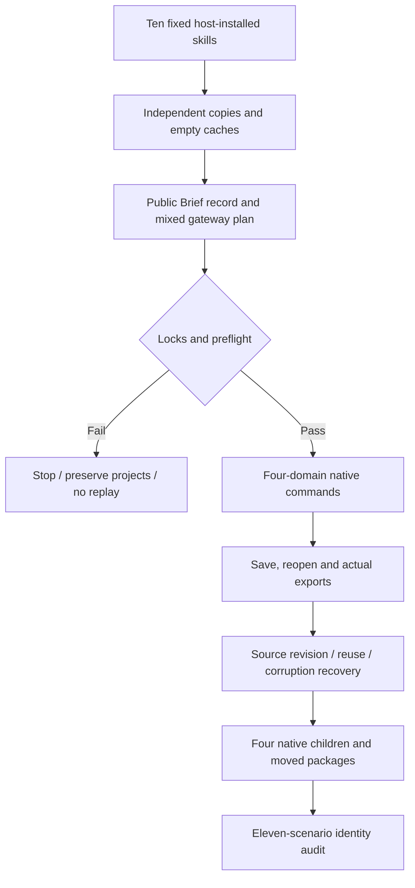

# ArtCraft capability-routing scenario acceptance architecture

Task 6.6 now covers all 11 named AC-DM-002 scenarios. Fixed identities: plugin `0.1.0-dev.126`, independent source `0.1.0-dev.98`, runtime `0.1.0-dev.126-runtime.1`; platform macOS arm64. Production bytes are unchanged. This is test/evidence maintenance without a duplicate release. Full V1 remains open.

[Version-bound evidence](evidence/routing-complete-fixed126-20261008.json) records per-entry calls and output digests, actual native gateway receipts, child projects/packages, model provenance/license/bytes/content version, and the eleven-scenario matrix. Earlier [specialized revalidation](ArtCraft-Routing-Scenario-Revalidation.md) and [selected installation evidence](ArtCraft-Selected-Setup-Architecture.md) retain their independent scope/logs.

## Scenario mapping

| AC-DM-002 suffix | Executed coverage |
|---|---|
| P | Fixed capability/native-format routing, inspectable four-domain output, native-format mismatch refusal |
| N | Pre-download Jianying refusal without substitute project |
| SELECT | Vector cold setup, incremental Photo, unchanged existing runtime/delivery, runtime-only status and verification |
| NATIVE-GATEWAY | Actual nativeCommand receipts in all four creations/source revisions; dependencies/export/loss/save/reopen; unknown preservation and cancelled-stage reopen |
| ASR-MIXED | Real first model download/inference, five children, Logo dependency revision, unrelated badge reuse, preserved captions/narration, moved package; failure handoff and readonly retry fixtures kept separate |
| COMMAND-HANDOFF | Offline 2646 catalog, actual four-domain component creation/revision, no false DAG acceptance; gateway budget/cancel/unknown/invalidation/recovery/package gates separate |
| VECTOR-APPEARANCE | Actual gradients/multiple fills/trusted swatch revision, preserved IDs/geometry/control pixels/top fill; PDF header only |
| EFFECT-EXPRESSION | Two-time alpha, preserved parent/control/composition, source revision and moved package |
| PHOTO-ADJUSTMENT | Reopened native mask/parameters, target/control pixels, other layers and original delivery |
| PHOTO-ADJUSTMENT-UNTRUSTED | Missing artifact/root and wrong/missing native digest refused, original preserved, no new native/PNG delivery |
| PUBLIC-GATEWAY-BRIEF | All ten pre-download scope/ambiguity/dependency/malformed refusals, actual metadata-changing gateways, plus full four-domain mixed cold creation/source revision/moved delivery through every entry |

PUBLIC-GATEWAY-BRIEF currently appears after AC-DM-006 in the delta specification, but its ID belongs to AC-DM-002. It is explicitly included as scenario eleven; no acceptance clause was moved or removed.

## Ten-entry full mixed acceptance

Each entry copies its own fixed host-installed skill and uses public downloads for Node, core and domain dependencies. No sibling skill is read, and no other entry's runtime is shared. A second isolated cache is created solely to test identity-conflict rejection. Each run covers four-domain creation, same-revision reuse, native installation receipt tamper/refusal/restoration, relocated-cache conflict, changed frozen-plan refusal, four trusted source revisions, Photo layout evidence corruption/recovery, and moved four-child plus variant packages.

Actual nativeCommand records in each domain's operations.json are required for both creation and source revision. Merely counting planned command names is insufficient. Reopened Film timing/rate is checked against actual media probing; revised Effect media is independently imported/probed. Sources remain intact and leases return to zero.

All 64 installed host skill trees are reverified. Each entry's 33 runtime files, native binaries, domain public-call files and copied skill match fixed locks, as do current source/plugin production skill bytes. Unrelated domain development worktrees are not fixed-release evidence.

## Model and failure boundaries

Whisper tiny provenance/license comes from the native public model catalog. Four actual files total 153547868 bytes, exactly matching the declared size; their SHA-256 values define the content version. Real ASR uses its declared persistent directory, and weights are excluded from packages. The model name alone is not content identity.

Added handoff fixtures cover unknown transcript.generate and explicit FAIL transcript.downloadModel: one domain call, preserved receipt/project and refused same-output replay. Separate readonly archive fixtures cover partial cleanup, bounded retry, and no retry for HTTP denial/size/filesystem errors. These are handoff tests, not a simulated outage of the remote model service. Actual native gateway unknown/cancellation tests separately prove stage reopen, process-group stop and no replay.

## Completion boundary

Source regression: 189 tests, 140 passed and 49 conditional skips. Eighteen command contract tests and three download boundary tests pass. Fresh plugin Python regression passes 106 tests with 6 skips, and the fixed skill vendor check passes. Unchanged production code retains digest-bound runtime regression (278 passed/21 skipped); ten explicitly enabled native mixed runs provide the new entry matrix.

Only task 6.6 and the current named AC-DM-002 scenarios close. Twenty-five numbered tasks and historical unchecked items remain. Catalog coverage is not exhaustive 2646-command execution. PDF visual quality, creative quality, GUI, other platforms, generic Skills CLI and full V1 retain separate gates. Incomplete specifications are not archived or synced.
