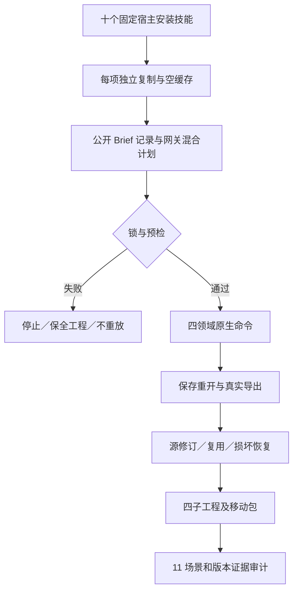

# ArtCraft 能力路由完整场景验收架构

任务 6.6 已完成当前 AC-DM-002 的全部 11 个命名场景。固定身份：插件 `0.1.0-dev.126`、独立技能源 `0.1.0-dev.98`、运行时 `0.1.0-dev.126-runtime.1`；平台为 macOS arm64。生产字节未变，本次仅维护验收驱动及双语证据，不创建重复发布。完整 V1 仍开放。

[完整版本绑定证据](evidence/routing-complete-fixed126-20261008.json)保存逐入口调用参数与输出摘要、真实原生命令回执、子工程与移动包摘要、模型来源／许可／大小／内容版本，以及 11 场景映射。此前[专项补验](ArtCraft-Routing-Scenario-Revalidation.zh_CN.md)和[选域安装验收](ArtCraft-Selected-Setup-Architecture.zh_CN.md)保留独立范围和日志。

## 命名场景与证据

| AC-DM-002 后缀 | 实际覆盖 |
|---|---|
| P | 按固定能力及原生格式执行；四领域可检查交付，格式不匹配拒绝 |
| N | 剪映请求下载前拒绝，无替代工程 |
| SELECT | Vector 首次冷安装、Photo 增量；旧运行时／交付保持；独立查询和验包不补装其他领域 |
| NATIVE-GATEWAY | 四域创建和源修订均含真实 nativeCommand 回执；依赖、导出、交换报告与保存重开；unknown 暂存保全及取消停止后重开 |
| ASR-MIXED | 真实首次模型下载与识别、五子工程、Logo 依赖返工、无关徽标复用、字幕时序和配音保持、移动包；失败交接与只读下载重试分别以 fixture 验证 |
| COMMAND-HANDOFF | 离线 2646 目录；四域公开组件实际创建／返工；组件不冒充 DAG 交付；完整网关另验预算、取消、unknown、失效恢复及移动包 |
| VECTOR-APPEARANCE | 实际渐变／多填充和可信色板返工；ID／几何／控制区／顶层填充保全；PDF 仅文件头 |
| EFFECT-EXPRESSION | 两时点 Alpha、父级／控制／合成保持、源返工及移动包 |
| PHOTO-ADJUSTMENT | 原生重开后的蒙版和调整参数、目标／控制像素、非目标层与原交付保持 |
| PHOTO-ADJUSTMENT-UNTRUSTED | 缺 artifact／根目录及错误／缺失原生摘要拒绝；原交付不变，无新原生或 PNG 交付 |
| PUBLIC-GATEWAY-BRIEF | 十入口下载前授权／歧义／依赖／畸形网关拒绝及真实元数据改变；十入口分别完整四域混合冷启动、源返工和移动交付 |

PUBLIC-GATEWAY-BRIEF 在现有增量规格中位于 AC-DM-006 段落之后，但 ID 属于 AC-DM-002，本次明确纳入第 11 项，未移动或删减验收条款。

## 十入口完整混合验收

每项入口都复制固定宿主中的自己的技能目录，不读取兄弟技能。公开下载 Node、编排包及四域依赖；除为验证身份冲突建立的第二缓存外，不共用其他入口的运行时。每项完成四域创建、同修订复用、领域原生安装回执篡改拒绝与恢复、变更缓存身份拒绝、未增版本计划拒绝、四种可信原生源修订、Photo 变体证据损坏／恢复、四子工程包和变体包移动核验。

创建及源修订分别检查四域 operations.json 中的真实 nativeCommand 回执；不是只统计计划中的命令名称。Film 实际时长和帧率由重开工程及成片探测交叉核验；Effect 源输出实际导入探测。原始工程和源素材保持，所有租约归零。

64 个宿主安装技能树重新核验；每项入口的 33 个运行时文件、原生二进制、领域公开调用文件、复制技能，以及当前源码／插件分发技能均与固定锁一致。其他领域当前开发工作区不作为固定快照验收证据。

## 模型与故障边界

Whisper tiny 通过公开模型目录记录来源和许可；实际四文件合计 153547868 字节，与原生声明相同，内容版本由四个 SHA-256 固定。真实 ASR 运行使用声明的持久目录，权重不随工程打包。未把模型名称单独当作内容身份。

新增交接 fixture 验证 unknown transcript.generate 与明确 FAIL transcript.downloadModel：只发生一次领域调用，原生回执／文件保留，同目录重跑拒绝。只读制品下载 fixture 另验半包清理、有界重试与 HTTP 拒绝／大小／文件权限错误不重试。这些是交接故障证据，不能称为真实远端模型服务故障注入。实际 native gateway unknown／取消验收单独证明暂存工程重开、进程停止和不重放。

## 完成范围

技能源回归 189 项：140 通过、49 条件跳过；18 项命令组件合同测试和 3 项下载边界测试通过。插件 Python 回归本次重跑 106 通过／6 跳过，固定技能分发检查通过；生产代码未变化，沿用摘要绑定的运行时 278 通过／21 跳过，并以本次十项可选真实混合验收补齐入口矩阵。

仅关闭 6.6 和对应 AC-DM-002 当前命名场景。仍有 25 项编号任务以及历史未关闭项待处理。2646 条目录不等于全量命令执行；PDF 视觉、创意质量、GUI、其他平台、通用 Skills CLI 与完整 V1 保持各自门禁。未归档或同步未完成规格。
