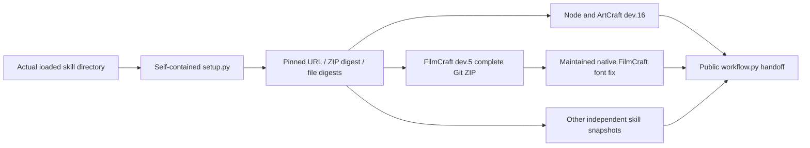
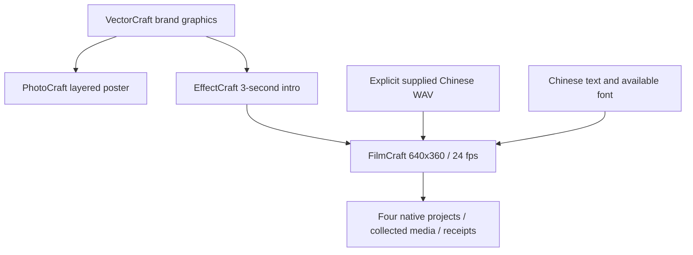

# ArtCraft Chinese mixed delivery and retained media architecture

## Drivers and version boundaries

Independent skill suite dev.14 uses orchestration runtime dev.16, FilmCraft skills dev.5 and maintained native CLI 0.2.0-craft.1. EffectCraft dev.6, PhotoCraft dev.5 and VectorCraft dev.5 retain their pinned digests. The plugin snapshot is updated separately after the independent source release; a runtime tag does not establish publication of new skills.

One installed ArtCraft revise skill must cold-install dependencies, create brand graphics, a layered poster, an animated intro and a film with Chinese voice and burned captions, then revise only captions while reusing the other three tasks. The plugin's existing establish-v1-plugin OpenSpec change owns AC-SK-003-CN and AC-SK-003-RETAIN. Evidence determines validation status; unit checks do not replace creative or model-dispatch acceptance.

## First-use distribution



The FilmCraft release ZIP is the complete immutable-tag Git archive. Repacking would change its published digest. The lock explicitly records archiveFormat git-archive-zip, sourceCommit, byte size and every regular-file digest. Zero-byte directory entries are accepted only for that format and only as safe ancestors of declared files. Links, escaping paths, undeclared directories and changed digests fail. Existing canonical archives keep their verification rules.

Resources resolve from the actual loaded skill and script directory. Skill installation and runtime user-data directories are separate. Each ArtCraft skill contains its own setup, distribution lock and examples; sibling skills are unnecessary.

## Chinese workflow



chinese-brand-campaign.json uses three-second audio and a 72-frame film. The test selects an explicitly installed macOS Chinese voice; the product workflow accepts supplied audio and does not install system voices. Captions retain the caption.caption alias and select Heiti SC. Font availability is a precondition: identical missing-glyph boxes cannot establish valid Chinese rendering. The maintained FilmCraft runtime fixes ignored font-family selection. Export requires audio and explicitly burns captions.

## Revision handoff

```json
{
  "sourceProject": {"assetId": "previous-film-output"},
  "assetBindings": [
    {"name": "intro", "assetId": "intro-video", "retained": true}
  ],
  "plan": {
    "operations": [
      {"command": "captions.setText", "params": {
        "caption": {"$ref": "caption.caption"},
        "text": "品牌焕新，精彩呈现。"
      }}
    ],
    "export": {"audioRequired": true, "burnCaptions": true}
  }
}
```

This payload fragment also requires a registered source-project external input, matching expectedRevision, new revision and outputs in the full workflow. Keep dependsOn intro; providedAssets is empty and voice is not resupplied. retained must be boolean. The adapter requires matching upstream-artifact, original manifest alias and packaged-file digests. It consumes the input and retains lineage without another --asset insertion. Prepare and verify recheck the source and upstream files.

Missing source, missing alias, changed upstream or collected file, and invalid flags fail. Changed upstream media requires explicit replacement. Ordinary bindings still import media, and all declared inputs must remain consumed.

## Evidence and operations

The single-skill default-public-download test checks four native projects, Chinese SRT, decoded frame count, caption-region pixel changes and voice correlation. Caption revision must reuse three task IDs, preserve original files and audio, avoid repeated revision budget usage and verify all four packaged child projects. It does not prove GUI operation, aesthetics or model-directed skill selection.

Runtime tests cover changed digests and upstream tampering before prepare and verify. Failures preserve old projects; failed installation hashes do not overwrite existing installations. Existing release tags and assets remain immutable. Successful acceptance produces a sanitized docs/evidence/chinese-mixed-first-use.json without user media, personal paths or temporary sessions.

Measured: both default-online single-skill tests passed in 51.379 seconds. Actual rendered Chinese captions were visually inspected; voice correlation was 0.99997449 and four-child package verification passed. [Sanitized evidence](evidence/chinese-mixed-first-use.json).
