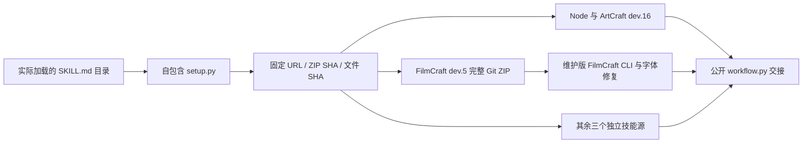
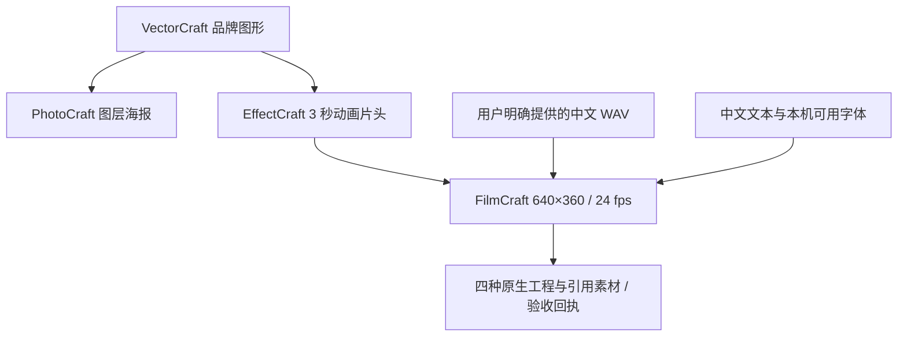

# ArtCraft 中文混合交付与素材保留架构

## 目标与版本边界

独立技能套件 dev.14 使用 ArtCraft 编排运行时 dev.16、FilmCraft 技能 dev.5 与维护版原生 CLI 0.2.0-craft.1。EffectCraft dev.6、PhotoCraft dev.5、VectorCraft dev.5 保持固定摘要。插件快照须在独立技能源发布后单独更新，运行时标签不能代表新技能已经发布。

目标是只安装一个 ArtCraft 返工技能便能冷启动完成品牌图形、海报、片头和带中文配音、烧录字幕的宣传片，并在仅修改字幕时复用其他三个任务。规范事实源仍为插件的 `establish-v1-plugin` 变更，对应 AC-SK-003-CN 与 AC-SK-003-RETAIN。当前验证状态以证据文件为准；不以单元测试替代创作或模型调度验收。

## 首次安装与依赖来源



FilmCraft 的发布 ZIP 是固定标签的完整 Git 归档，不能重新打包成另一种格式再沿用原摘要。分发锁使用 `archiveFormat: git-archive-zip`、`sourceCommit`、ZIP 字节数与所有普通文件摘要。安装器只允许显式格式下的零字节目录项，目录必须是声明文件的安全祖先；拒绝链接、逃逸路径、未声明目录与摘要变化。原有规范化 ZIP 仍按原规则验证。

技能路径从实际加载目录取得，脚本通过自身位置解析资源；技能目录与用户数据中的 CLI 安装目录独立。每个 ArtCraft 技能包含安装器、分发锁和示例，不假定兄弟技能已经安装。

## 中文混合工作流



示例 `chinese-brand-campaign.json` 使用 3 秒音频与 72 帧成片。中文配音由验收环境中已安装且明确指定的 macOS 语音生成；技能的实际产品流程接受用户提供的音频，不安装系统语音。字幕保存 `caption.caption` 绑定，显式使用支持中文的 `Heiti SC` 字体。字体可用性是运行前条件，不能把同样的缺字方框当作成功渲染。维护版 FilmCraft 修复原生绘制忽略字体族的问题，导出显式要求音轨并烧录字幕。

## 局部返工合同

```json
{
  "sourceProject": {"assetId": "previous-film-output"},
  "assetBindings": [
    {"name": "intro", "assetId": "intro-video", "retained": true}
  ],
  "plan": {
    "operations": [
      {"command": "captions.setText", "params": {
        "caption": {"$ref": "caption.caption"},
        "text": "品牌焕新，精彩呈现。"
      }}
    ],
    "export": {"audioRequired": true, "burnCaptions": true}
  }
}
```

上例是 payload 片段，完整计划还须登记原工程外部输入、匹配的 `expectedRevision`、新修订号与输出。`dependsOn: [intro]` 保留；本次 `providedAssets` 为空，无需重新传入配音。`retained` 必须是布尔值。适配器校验上游片头、原工程同名素材和已收集文件三者摘要一致后，消费该输入并保留血缘，但不重复传入领域 CLI 的 `--asset`。在 prepare 与 verify 阶段重新核验，防止计划后文件变化。

原工程不存在、素材别名缺失、上游摘要变化、文件摘要变化或参数类型错误均失败。上游片头变化时需要显式替换媒体；不能用保留绑定掩盖过期依赖。其他正常素材绑定继续导入，原有输入必须全部消费的约束保持有效。

## 验收证据与运维

`tests/test_chinese_mixed_first_use.py` 从单独复制的返工技能执行默认公开下载，验证四种原生文件、SRT 中文、成片解码帧数、字幕区域像素变化和配音相关性；随后只更新 Film 任务，验证三个任务 ID 复用、旧文件摘要不变、音轨保留、重复修订预算不变与四子工程验包。该测试不证明 GUI、审美质量或模型自动选择技能。

运行时单元测试还覆盖摘要变化和 prepare/verify 间的上游文件篡改。失败时不删除旧工程；安装摘要失败不替换已安装内容。旧固定标签及制品保持不可变。当前版本验收成功后将保存脱敏的 `docs/evidence/chinese-mixed-first-use.json`，不提交音频、成片、个人路径或临时会话。

实测：单技能默认在线测试 2 项通过（51.379 秒），实际成片中文字幕已目视检查；配音相关性 0.99997449，四子工程验包通过。[脱敏证据](evidence/chinese-mixed-first-use.json)。
