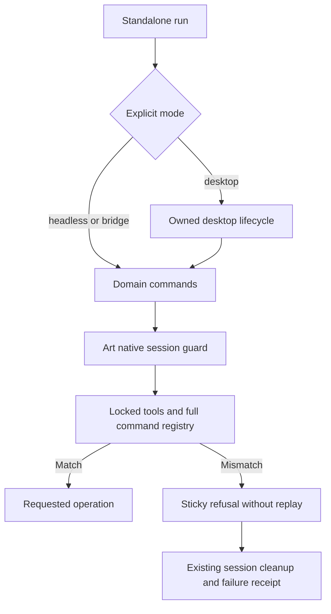

# ArtCraft command mode contract architecture

The candidate extends the existing headless contract guard to every standalone run mode. domain_commands.py wraps commands.py for headless/bridge and desktop.py for owned desktop execution. DesktopSession imports the native MCP Session in the same process; interception therefore preserves its existing listener ownership, token handling and cleanup. Domain files are not modified.

EffectCraft bridge adds nine tools from its separately locked bridge snapshot. The snapshot must identify the domain, bridge mode, native runtime and desktop binary. Its tools must have valid schemas and cannot collide with the base snapshot. Missing/malformed/non-object snapshots and non-hexadecimal identity digests refuse before entry or native module execution. Headless does not inherit bridge tools. The full command registry and sticky refusal rules apply in all three modes.

Evidence is deliberately separated:180 controlled command cases across4 domains and3 modes;26 bridge identity refusals;220 combined boundary targets;206 current source tests (154 pass/52 conditional skips),551 runtime tests (526 pass/25 conditional skips),123 plugin Python tests (112 pass/11 conditional skips);36 real headless native post-save faults against candidate core and fixed133 dependencies. The ten standalone launchers match the embedded DAG bytes. [Candidate evidence](evidence/command-mode-candidate-20261009.json).

Actual bridge/GUI and a new fixed distribution are not verified by these fixtures. Desktop automation again fails during initialization with a kernel-assets filesystem error. Task4.6 and5.3 remain open, as do all12 outstanding tasks. Previously published134/106 assets retain their original behavior and evidence.
