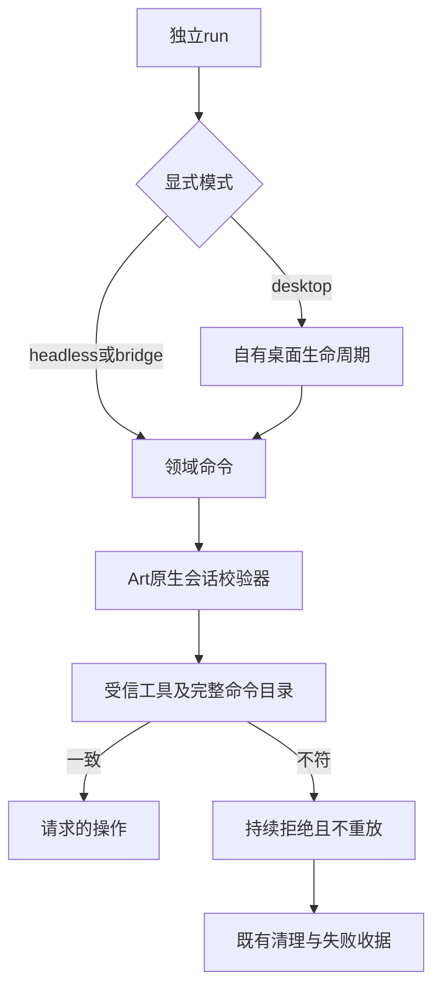

# ArtCraft 命令模式合同架构

候选实现把既有headless合同校验覆盖到独立命令的所有run模式。domain_commands.py在headless／bridge下包装commands.py，在自有desktop模式下包装desktop.py。DesktopSession在同一进程中加载原生MCP Session，因此拦截保持现有监听归属、令牌管理和停止清理。领域文件不修改。

EffectCraft bridge从单独锁定快照补充9项工具，核对领域、bridge模式、原生runtime和desktop binary身份；工具schema必须有效，且不得与基础快照重名。快照缺失、畸形、非对象或摘要非十六进制时，在入口及原生模块执行前拒绝。headless不继承bridge工具。三模式均执行完整命令目录校验和拒绝后不可恢复编辑的规则。

证据分层保留：四领域／三模式180项受控命令用例；26项bridge身份拒绝；合计220项边界目标测试；当前206项技能源回归（154通过／52条件跳过）、551项运行时回归（526通过／25条件跳过）、123项插件Python回归（112通过／11条件跳过）；候选核心结合固定133依赖的36项真实headless原生保存后故障。十个独立启动器与DAG内嵌字节一致。[候选证据](evidence/command-mode-candidate-20261009.json)。

夹具不能证明实际bridge／GUI或新的固定分发验收。桌面自动化再次在初始化时报kernel assets文件系统错误。任务4.6、5.3以及全部12项未完成任务保持开放。此前134／106发行附件保持原行为和证据范围。

## 实际EffectCraft bridge检查点

固定签名EffectCraft0.2.0桌面包在隔离验收目录完成归档／二进制摘要和签名校验。候选校验器核对实际30项工具（基础21＋bridge9）、640命令ID及参数描述，再读取真实ui_inspect／ui_elements响应。监听端口确属本次启动桌面PID，会话后自有桌面与原生CLI均停止。原始响应和过程证据保留并绑定摘要。[原生bridge证据](evidence/native-effect-bridge-candidate-20261009.json)。

这补齐EffectCraft实际bridge只读探针，不能证明GUI编辑、其他领域bridge或新固定安装验收。原生bridge成为实际GUI版本冲突门禁的可用后续路径，与CUA初始化故障分开记录。
