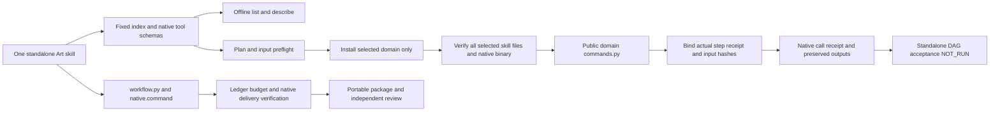
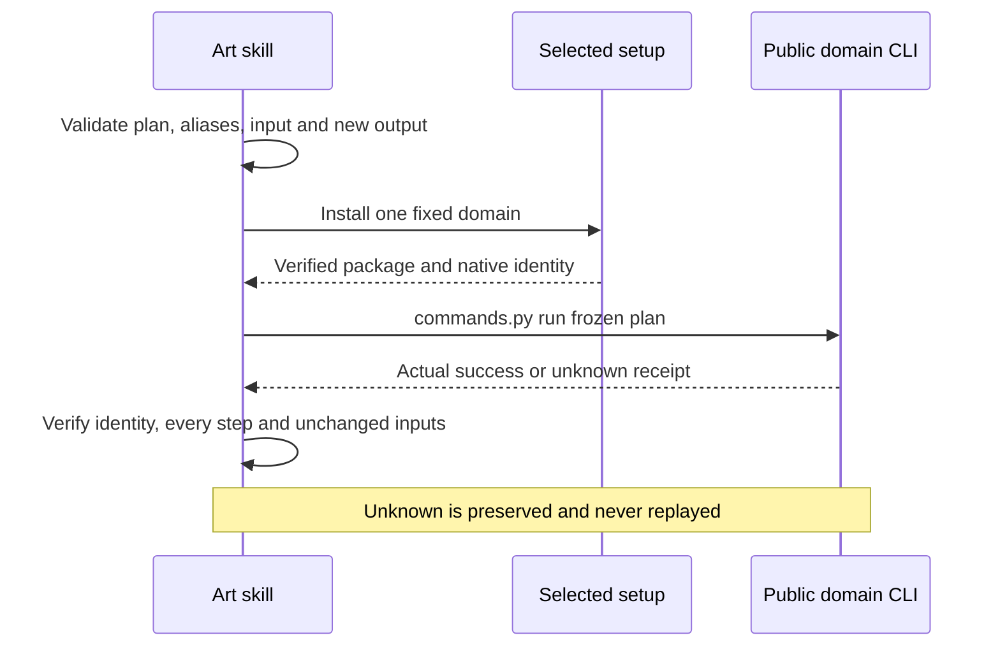

# ArtCraft complete domain command component

The current pinned Art distribution indexes 2646 commands: Film 666, Effect 640, Photo 755 and Vector 585. Each installed skill’s distribution.lock.json owns the actual source identity. Offline queries, standalone command calls and DAG workflows are separate entry points. Native command DAG delivery has fixed-version joint evidence under OpenSpec 6.51; exhaustive command, GUI and creative acceptance remain separate.

The index and eight creation/revision plans come from immutable source tags in distribution.lock.json. Catalog and MCP snapshot text must match the lock's per-file hashes. No floating checkout, sibling skill, model-selected executable or private module import is used. Querying requires no installation. Check and run install only the chosen domain plus the existing Art runtime. Existing creative workflow behavior remains unchanged.

Parameters retain the native syntax; command parameter text is not invented JSON Schema. Actual MCP tool schemas have a separate describe --tool query. Command plans support actual result references, explicit copied inputs and output-relative paths. Live enabled state and native parameter validation remain the domain CLI's responsibility. Bridge mode forwards explicit connection arguments; GUI acceptance is not established by headless samples.

A successful native call produces artcraft-command-call.json, bound to the immutable bundle, native binary and actual domain receipt. It is not a craft-artifact delivery manifest or review_ready state. Missing, malformed, mismatched or incomplete replies preserve the output and report an unknown outcome. Native editing is never retried. Existing output directories are rejected before installation; input changes during setup stop before editing. Temporary download recovery retains the existing checksum policy.

The DAG route uses workflow.py and the public domain workflow adapters, with native.command inside the domain plan. It retains editable projects, collected dependencies, loss reports, reopening/export validation, budget/cancellation, revision invalidation/recovery and portable packages. Direct component calls do not create that DAG evidence. See [fixed gateway joint acceptance](evidence/codex-native-gateway-first-use-20261007.json) and the later [fixed Art117 gateway export evidence](evidence/craft-art117-gateway-export-fixed-first-use-20261008.json).

Tests separate offline all-ten query/identity/preflight/recovery contracts from actual public cold installation, native creation, targeted revision, reopening, persisted state, target/control pixel checks and source preservation. Fixed plugin installation is a further gate. The 2646-command exhaustive acceptance, GUI, model and completeV1 remain open.

Historical plugin82 / source56 passed ten installed skills × four domains (40 empty-cache native cases,920 operations), with all58 installed hashes unchanged. That checkpoint closed component gate6.50 only. Later 6.51 joint acceptance is recorded in the linked evidence; it does not establish exhaustive command acceptance.

Fixed Art119/source91 qualifies the current guide distribution and metadata repair:ten installed skills use independent empty public runtime homes, with a real expression source revision/moved package and64 public CLI probes. Historical evidence keeps its original scope; exhaustive commands and fullV1 remain open. [Evidence](evidence/craft-art119-guidance-fixed-first-use-20261008.json).
