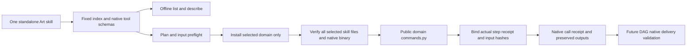
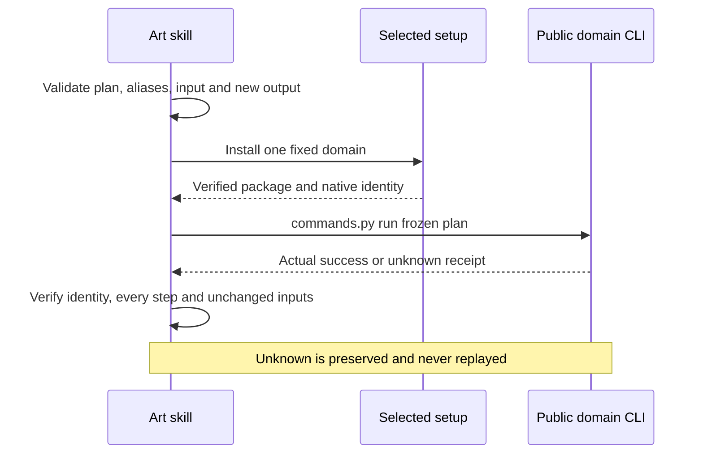

# ArtCraft complete domain command component

The four standalone domains expose2639 reflected commands, but the Art DAG adapter currently invokes only the constrained workflow delivery interface. The new component provides the public handoff needed for complete command plans. Full DAG native command delivery remains a required next step under AC-DM-002/6.51.

The index and eight creation/revision plans come from immutable source tags in distribution.lock.json. Catalog and MCP snapshot text must match the lock's per-file hashes. No floating checkout, sibling skill, model-selected executable or private module import is used. Querying requires no installation. Check and run install only the chosen domain plus the existing Art runtime. Existing creative workflow behavior remains unchanged.

Parameters retain the native syntax; command parameter text is not invented JSON Schema. Actual MCP tool schemas have a separate describe --tool query. Command plans support actual result references, explicit copied inputs and output-relative paths. Live enabled state and native parameter validation remain the domain CLI's responsibility. Bridge mode forwards explicit connection arguments; GUI acceptance is not established by headless samples.

A successful native call produces artcraft-command-call.json, bound to the immutable bundle, native binary and actual domain receipt. It is not a craft-artifact delivery manifest or review_ready state. Missing, malformed, mismatched or incomplete replies preserve the output and report an unknown outcome. Native editing is never retried. Existing output directories are rejected before installation; input changes during setup stop before editing. Temporary download recovery retains the existing checksum policy.

The mandatory next DAG gate must consume this component through the public interface and bind editable native projects, collected dependencies, loss reports, actual reopening/export validation, task budget/cancellation, revision invalidation/recovery and moved delivery packages. Current runtime78 continues to use the workflow adapter; this component does not silently widen that adapter.

Tests separate offline all-ten query/identity/preflight/recovery contracts from actual public cold installation, native creation, targeted revision, reopening, persisted state, target/control pixel checks and source preservation. Fixed plugin installation is a further gate. The2639-command exhaustive acceptance, GUI, model and completeV1 remain open.

Fixed plugin82 / source56 passes ten installed skills × four domains (40 empty-cache native cases,920 operations), with all58 installed hashes unchanged. This closes component gate6.50 only; full DAG gate6.51 stays open.
