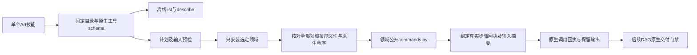
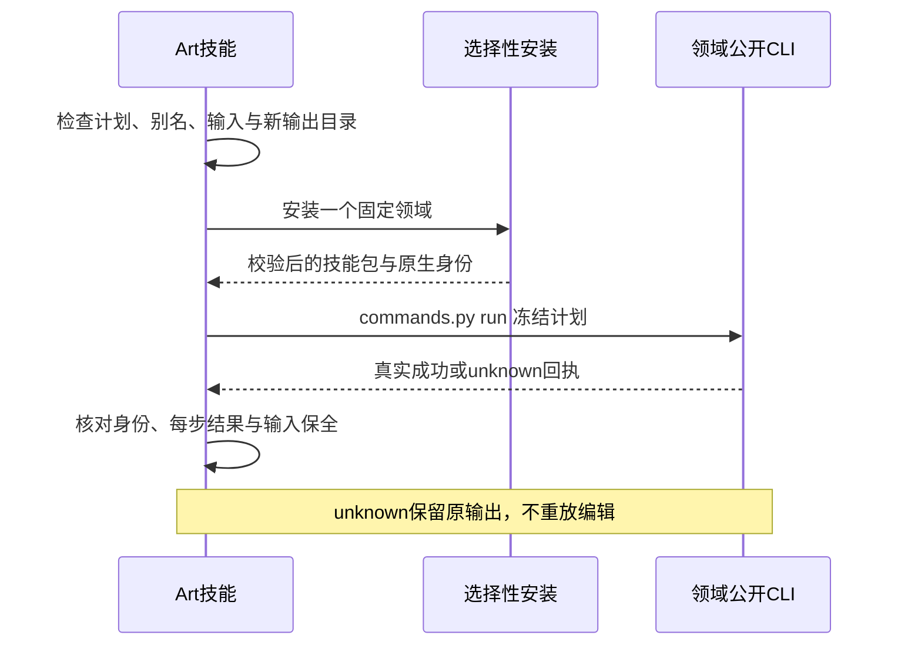

# ArtCraft 完整领域命令交接组件

四个独立领域已有2639条反射命令，但Art的DAG适配器目前仍调用受约束的工作流交付接口。新组件提供完整命令计划的公开交接基础；完整DAG原生命令交付仍是AC-DM-002/6.51要求完成的下一阶段。

索引及八个创建／返工计划来自distribution.lock.json中的不可变标签。目录与MCP快照原文必须匹配锁中的逐文件摘要。查询不安装依赖；check/run只安装选定领域及既有Art运行时。不读取兄弟技能，不使用浮动工作树、模型指定执行器或跨技能私有模块导入。原有创作工作流保持其合同。

命令参数保留原生语法，不能把参数说明冒充JSON Schema；实际MCP工具schema通过独立describe --tool查询。计划支持真实返回值引用、明确复制的输入及输出相对路径。实时enabled与原生参数验证由领域CLI执行。bridge模式显式透传连接参数；headless样例不能证明GUI验收。

成功调用生成artcraft-command-call.json，绑定不可变领域包、原生程序及实际领域回执，不是craft-artifact交付manifest或review_ready。缺失、畸形、身份不符或未完成回复保留输出并报告unknown；不自动重放编辑。既有输出目录在安装前拒绝，安装期间输入改变则在编辑前停止。临时下载恢复继续保留摘要边界。

后续DAG门禁必须通过公开接口消费本组件，绑定可编辑原生工程、收集依赖、交换损失、真实重开／导出核验、任务预算／取消、修订失效／恢复及移动包。当前runtime78继续使用工作流适配器，本组件不默默放宽其交付合同。

测试分别验证十技能离线查询／身份／预检／unknown边界，以及真实公开冷安装、创建、局部返工、重开、持久状态、目标及对照像素、源保全。固定插件82／技能源56的十技能×四领域40项空缓存原生样例通过，920次操作及58安装摘要保全；只关闭组件门禁6.50。2639条逐项命令、GUI、模型及完整V1保持开放。
