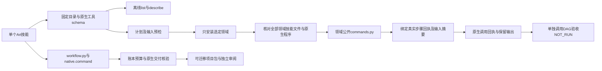
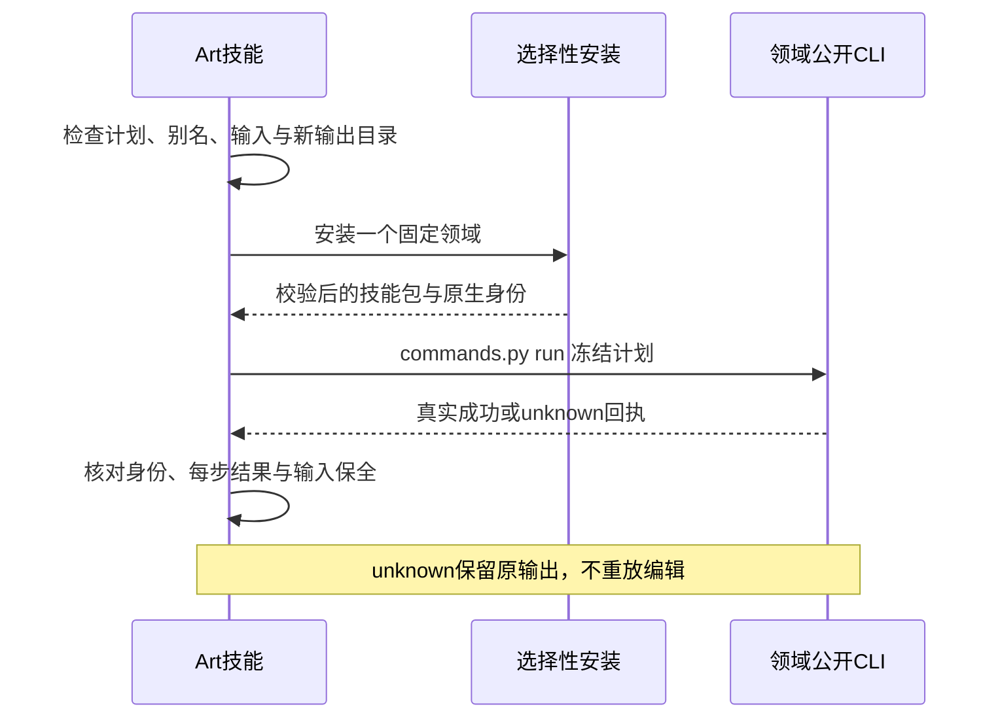

# ArtCraft 完整领域命令交接组件

当前固定 Art 分发目录收录 2646 条命令（Film 666、Effect 640、Photo 755、Vector 585），实际来源以独立技能的 distribution.lock.json 为准。离线查询、单独命令组件与 DAG 工作流是三个入口；DAG 中的 native.command 已通过 OpenSpec 6.51 固定版本联合验收。该证据不替代全部命令的逐项、GUI 或创作验收。

索引及八个创建／返工计划来自distribution.lock.json中的不可变标签。目录与MCP快照原文必须匹配锁中的逐文件摘要。查询不安装依赖；check/run只安装选定领域及既有Art运行时。不读取兄弟技能，不使用浮动工作树、模型指定执行器或跨技能私有模块导入。原有创作工作流保持其合同。

命令参数保留原生语法，不能把参数说明冒充JSON Schema；实际MCP工具schema通过独立describe --tool查询。计划支持真实返回值引用、明确复制的输入及输出相对路径。实时enabled与原生参数验证由领域CLI执行。bridge模式显式透传连接参数；headless样例不能证明GUI验收。

成功调用生成artcraft-command-call.json，绑定不可变领域包、原生程序及实际领域回执，不是craft-artifact交付manifest或review_ready。缺失、畸形、身份不符或未完成回复保留输出并报告unknown；不自动重放编辑。既有输出目录在安装前拒绝，安装期间输入改变则在编辑前停止。临时下载恢复继续保留摘要边界。

完整 DAG 使用 workflow.py 的公开领域工作流适配器，在领域计划中声明 native.command；它继续绑定可编辑工程、收集依赖、交换损失、真实重开／导出核验、任务预算／取消、修订失效／恢复及移动包。原生命令组件直接调用仍不生成上述 DAG 证据。固定联合验收见 [网关首用证据](evidence/codex-native-gateway-first-use-20261007.json)；当前 Vector 网关导出补证见 [固定 Art117 证据](evidence/craft-art117-gateway-export-fixed-first-use-20261008.json)。

测试分别验证离线查询／身份／预检／unknown 边界，以及真实公开冷安装、创建、局部返工、重开、持久状态、目标及对照像素、源保全。历史插件82／技能源56的十技能×四领域40项空缓存原生样例通过，920次操作及58安装摘要保全；当时只关闭组件门禁6.50，后续6.51联合验收见上述证据。当前2646条命令的逐项完整上下文、GUI、模型及完整V1仍保持开放。

固定Art119／源91完成当前指南分发与身份修复验收：十个实际安装技能各用空公开运行时，另有原生表达式可信源返工、移动包和64公开CLI核验。旧发行证据保持原范围；全量命令和完整V1仍开放。 [Evidence](evidence/craft-art119-guidance-fixed-first-use-20261008.json).
