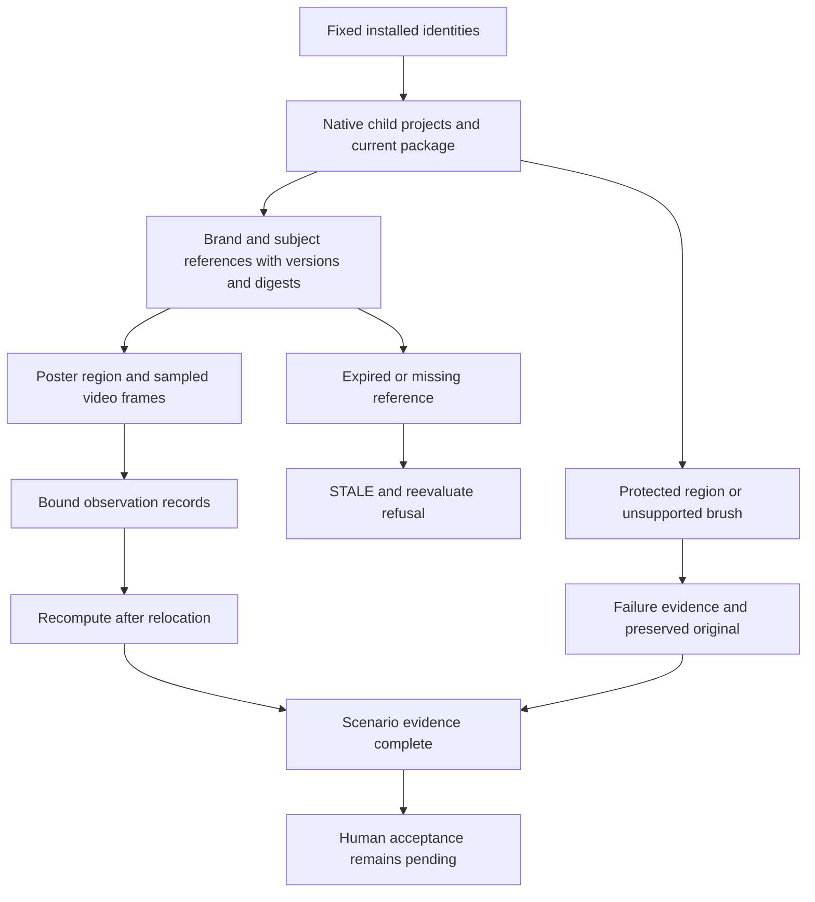

# ArtCraft Consistency Acceptance Architecture

> Scope: version-bound acceptance for AC-DM-005 and task 6.15.
> Version: 1.0.0 · Updated: 2026-10-09

## 1. Decision and ownership

Task 6.15 is complete for all four named specification scenarios on macOS arm64. The authoritative specification remains the plugin OpenSpec change `establish-v1-plugin`; the skills repository mirrors evidence. Plugin dev.127 locks source dev.99 and runtime dev.126-runtime.1. This acceptance update changes tests and documentation only; existing immutable release assets remain valid.

## 2. Evidence flow

## 3. Scenario mapping

| Scenario | Observable result |
|:---|:---|
| AC-DM-005-P | Compare fixed logo/subject with native poster and intro/film frame 6; bind version, digest and position; frame 0 failure retains its target; moved records verify. |
| AC-DM-005-N | Old reference version and missing target digest produce STALE/reevaluate with no published review output. |
| AC-DM-005-PHOTO | Current Photo rejects changed protected header, retains only failure evidence and zero outputs, preserves original; valid revision and unchanged footer report verify after relocation. |
| AC-DM-005-RETOUCH | Current Photo executes native pixel-layer brush revision and preserves before/after and protected report. Legacy Art26/runtime28/Photo6 fails unsupported brush, preserves original and old moved package, and repeats the failure safely. |

Legacy Art reports a generic failure. The separate legacy Photo public entry reports `unsupported_command`; that domain observation is not attributed to Art's diagnostic collector.

## 4. Validation and limits

[Complete evidence](evidence/consistency-complete-fixed127-20261009.json) binds the four scenarios, release identities, specification digest and constituent proofs. The explicit legacy first-use test passed once; source regression ran 199 tests: 149 passed and 50 conditional skips. All 64 installed host skill trees were rechecked. Source comparisons use Git-tracked inventory, excluding untouched ignored Python caches.

Actual visual observations cover the logo shape/wordmark, red circular subject, poster and sampled frame 6. The subject overlaps part of the logo in the video samples; this does not establish safe-area or unobscured-logo approval. Color metrics supplement the observations. Review decision remains pending and human acceptance NOT_RUN. Full-video quality, general semantic guarantees, runtime model dispatch and generic Skills CLI installation are outside this completed gate. Twenty-one numbered tasks plus historical SC-003 remain open (22 total); full V1 remains open.

---
Document version: 1.0.0 · Created/updated: 2026-10-09 · Status: verified for the bounded gate above.
