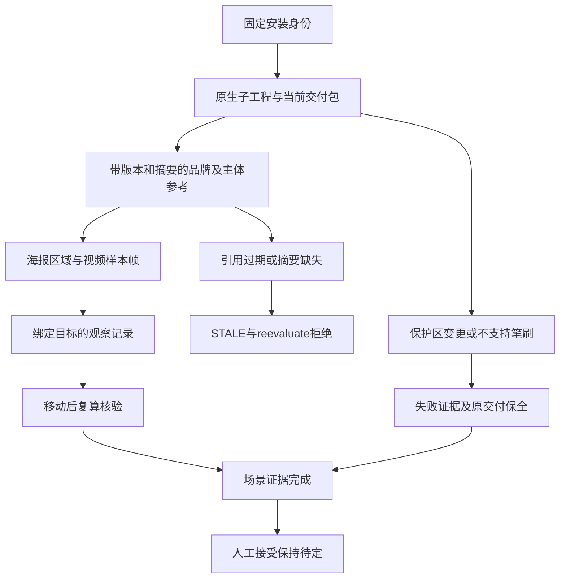

# ArtCraft 一致性验收架构

> **文档说明**：记录 AC-DM-005 与任务 6.15 的版本绑定验收及边界。
> **版本**：V1.0.0
> **最后更新**：2026-10-09

## 1. 结论与责任

任务 6.15 的四个具名规范场景已在 macOS arm64 验证完成。唯一规格事实源仍是插件 OpenSpec 的 `establish-v1-plugin` 变更，技能仓镜像证据。插件 dev.127 锁定技能源 dev.99 与 runtime dev.126-runtime.1。本次仅补充测试、文档及证据，不改变已发布安装包与标签。

## 2. 证据流

## 3. 场景与结果

| 场景 | 可观察结果 |
|:---|:---|
| AC-DM-005-P | 固定 Logo／主体与原生海报、片头及成片第 6 帧比对，绑定版本、摘要及定位；第 0 帧失败保留目标；移动审阅记录可核验。 |
| AC-DM-005-N | 旧参考版本及目标摘要缺失返回 STALE／reevaluate，不发布审阅输出。 |
| AC-DM-005-PHOTO | 当前 Photo 拒绝保护标题区变化，仅保留失败证据且零输出，原交付不变；合法修订及页脚零变化报告随移动包核验。 |
| AC-DM-005-RETOUCH | 当前 Photo 完成像素图层笔刷修订，保留前后图及保护报告；旧 Art26／runtime28／Photo6 拒绝不支持的笔刷，原交付与移动旧包保持可核验，重复请求仍安全失败。 |

旧 Art 只记录通用失败。独立运行旧 Photo 公开入口才得到 `unsupported_command`；不将独立领域诊断冒充 Art 已采集的错误原因。

## 4. 验证与限制

[完整证据](evidence/consistency-complete-fixed127-20261009.json) 绑定四场景、发行身份、规格摘要及各项证明。旧版公开首次使用测试实际通过 1 项；源码回归共 199 项，149 项通过、50 项条件跳过。宿主 64 个安装技能树再次核验。源码身份按 Git 跟踪文件比较，未触碰已有忽略的 Python 缓存。

实际观察覆盖 Logo 形状和字标、红色圆形主体、海报及视频第 6 帧。视频样本中主体遮挡部分 Logo，不能据此声称安全区或无遮挡设计获批。颜色计数仅补充观察。审阅决定保持 pending，人工接受为 NOT_RUN；完整视频质量、通用语义保证、运行时模型调度和通用 Skills CLI 安装不在本次完成门禁内。仍有 21 项编号任务及历史 SC-003（共 22 项），完整 V1 未完成。

---

**文档版本**：V1.0.0
**创建日期**：2026-10-09
**最后更新**：2026-10-09
**文档状态**：已验证上述有限验收范围
