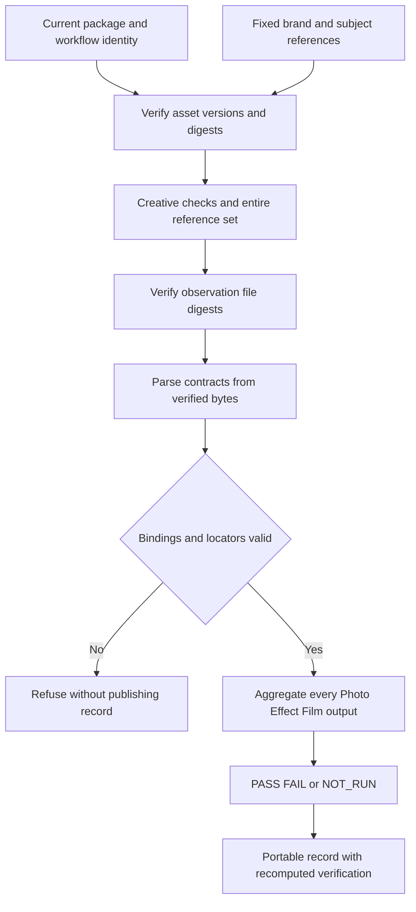

# ArtCraft Fixed-Reference Consistency Review Architecture

Fixed127/source99 core implementation and installed qualification are now verified;6.14 is complete. The earlier paragraphs are historical checkpoints. Complete6.15, including the old unsupported-dependency/source-preservation evidence audit, remains open. [Fixed evidence](evidence/consistency-fixed127-20261009.json).

Earlier distribution checkpoint: source99 is published and vendored into plugin candidate127. Runtime126 and domain pins are unchanged. Installed qualification and full scenario acceptance remain open. [Distribution evidence](evidence/consistency-distribution-candidate-20261009.json). The source-candidate paragraph below describes the earlier checkpoint.

This is a source candidate. Task6.13 has target-failure evidence and eight subsequent passing tests. Task6.14 distribution/regression gates and task6.15 complete native scene acceptance remain open. The plugin still locks source98; public plugin126 does not contain the new behavior.

## Contract and data flow

The existing review.py record/verify entry accepts optional consistency input. Brand and subject references must identify current packaged assets, with brands also matching top-level brandReferences. Every assessment uses the same complete reference set. Creative-check evidence contains strict observation JSON bound to target, references, evaluator and status. A prompt-only JSON file is refused even when its digest matches.

Photo targets require normalized regions; Effect and Film targets require frames. Coverage applies to every actual output: an unreviewed additional cover prevents PASS. Failures retain versions and locators; missing outputs, domains or NOT_RUN observations produce NOT_RUN. This result never completes the task or substitutes for human acceptance.

Records retain craft-review-record/v1. The optional consistency result appears only with the new input contract. Legacy records remain supported. After relocation, verification checks inventory, hashes, input and observations and recomputes results. Changing or deleting aggregation fields and recomputing the outer hash does not bypass verification.

## Evidence and remaining gates

See [candidate evidence](evidence/consistency-candidate-20261009.json). The original implementation produced three target-field errors among five tests. Eight new tests and seven legacy review tests pass after implementation. These are protocol fixtures, not native-project, actual image/frame observation, installed-release or complete-scenario acceptance. Complete regression, immutable skill distribution and fixed-host verification remain required before release; existing release tags remain unchanged.

A subsequent actual five-child native candidate now passes procedural brand/subject color-presence observations in the poster and frame6 of both videos, moved-record verification, stale-reference and missing-digest refusals, prompt-only refusal, NOT_RUN coverage and forged-result refusal. Frame0 during the planned opacity fade correctly records measured brand-color absence as FAIL with frame/version bindings; this does not establish an unintended native defect. Human acceptance remains pending. See [native candidate evidence](evidence/consistency-native-candidate-20261009.json). Full installed-release and four-scenario acceptance remain open.
