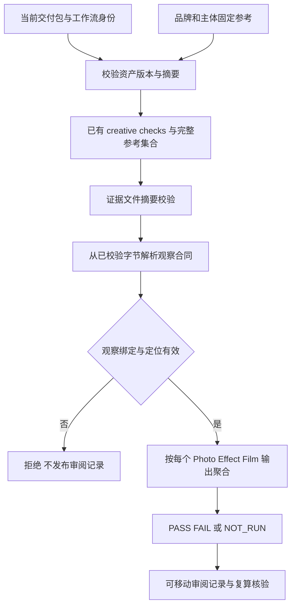

# ArtCraft 固定参考一致性审阅架构

当前为源码候选：6.13 的目标失败测试及后续 8 项测试已验证。6.14 的固定分发／回归门禁、6.15 的完整真实场景验收仍未完成；插件仍锁定 source98，公开 plugin126 不包含新增行为。

## 合同与数据流

沿用现有 review.py record/verify 入口，输入可选 consistency。品牌与主体引用必须存在于当前包，品牌同时匹配顶层 brandReferences；每条 assessment 使用完整且相同的参考集合。creative check 的 evidence 包含严格 JSON 观察合同，绑定目标、参考、评价者及状态。仅含提示词的 JSON 即使摘要匹配也拒绝。

Photo 目标必须有归一化区域，Effect／Film 必须有帧。覆盖按每个实际产物计算，额外封面未审阅也不能得到 PASS。任一失败保留版本和定位；缺失产物、领域或 NOT_RUN 返回 NOT_RUN。此结果不会自动完成任务或代替人工接受。

记录仍为 craft-review-record/v1，可选 consistency 结果仅随新输入出现。旧输入与记录保持兼容；移动后重新校验文件清单、摘要、输入和观察并复算结果，改写聚合值或删除结果后重算外层摘要也不能通过。

## 证据与剩余工作

证据见 [候选记录](evidence/consistency-candidate-20261009.json)。原实现 5 项测试中的 3 项因目标字段不支持失败；新增实现 8 项通过，既有审阅 7 项通过。这些是协议 fixture，不能替代原生工程、真实图像／帧观察、固定安装和全部规范场景。发布前继续完整回归、锁定新技能源以及固定宿主验收，不改写旧发布标签。
