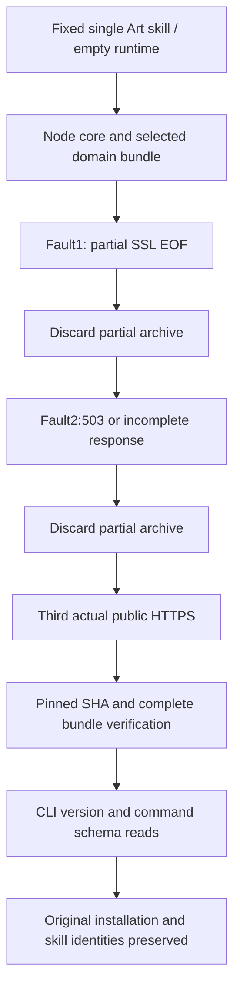

# ArtCraft Current Fixed Download Recovery Acceptance Architecture

Current plugin130/source102/runtime129 now has fixed evidence for outer archive and native domain download recovery. Task4.6 remains open; four of its14 named scenarios have current focused acceptance evidence.

The native exercise separately copies one installed Art skill into four isolated projects, each with an initially absent runtime. Current public bootstrap selects only the corresponding domain. Test-only transport hooks make the child native installer read partial bytes and fail with SSL EOF, then receive an incomplete Content-Length response. The third attempt performs real public HTTPS. Before each retry, the prior partial archive must be absent. All four domains succeed on attempt3; actual Node/core/domain bundle downloads, native digest, executable --version and command catalog checks pass. Individual installs take approximately47–75seconds; the installed test passes in74.951seconds.

A separate fresh single-skill outer exercise selects Vector. Node, Art core and complete Vector skill archives each receive partial SSL EOF then HTTP503, followed by a real third download: nine outer requests. Node/native binaries and every core/domain bundle file are verified. This installed test passes in36.798seconds. It probes these three explicit archives, not fault injection into every domain outer archive. Installer/lock file sets are byte-identical across all10 Art skills; the four native exercises also verify actual cold selection/install for every domain.

Negative boundaries remain separate from real download evidence. The four current complete child bundles pass63 test_bootstrap cases covering three-attempt bounds, certificate/403/permission final refusal, size/digest errors, safe extraction and installed-file preservation. Three current Art helper tests explicitly exercise SSL EOF, connection reset, timeout, incomplete responses and408/429/500/503 recovery plus final cleanup. Five Node and eight archive-install controlled tests also pass. These use isolated fixtures and do not claim real-service refusals. Test ownership is the plugin repository; the skills mirror carries documentation/evidence only.

[Complete evidence](evidence/current-download-recovery130-20261009.json) binds each child installer, raw calls/events and test digests. All64 fixed host skill trees are reverified. Production sources, installations, retry constants, old tags and assets remain unchanged. Hooks live under plugin test/fixtures. Ordinary CI skips explicit network-install tests and runs normal boundary tests separately. Native calls only read versions/schemas; no editing or rendering requests are replayed.

The two rows move from retained-evidence-needs-audit to verified-current-installed. Earlier Art80 download failures and historical releases remain preserved, with current proof recorded independently. Ten scenarios and12 numbered tasks remain open; OpenSpec/full V1/GUI/other-platform acceptance is not completed.

The first outer script checked ZIP partials only. After identifying the Node tar.gz gap, the prior script/results were retained and a fresh empty-cache run verified both formats; current evidence binds that strengthened rerun.
