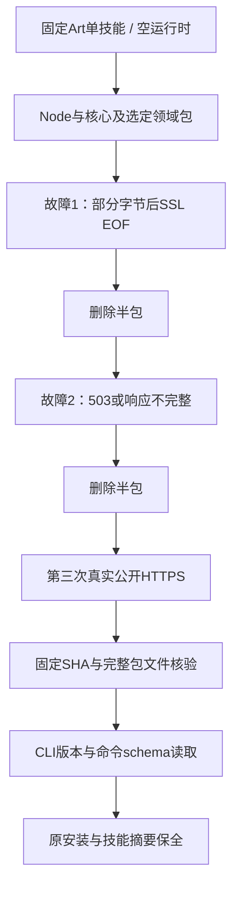

# ArtCraft 当前固定下载恢复验收架构

插件130／源102／runtime129的外层归档下载与领域原生下载两个场景已补齐当前固定分发验收。4.6整体继续开放，14个场景中现有四个具备当前专项证据。

原生下载专项将已安装的单个Art技能分别复制到四个隔离项目，每个运行时最初不存在。运行当前公开bootstrap，只选择对应领域。测试钩子仅修改传输行为：原生安装子进程先读取部分字节后SSL EOF，再收到Content-Length不完整响应；第三次使用真实公开HTTPS下载。每次下一轮请求前确认半包已删除。四领域全部在第三次成功，真实Node／核心／领域技能归档下载、原生二进制摘要、实际--version及命令目录读取均通过。四次独立安装耗时约47至75秒；原生专项1项通过，总耗时74.951秒。

外层专项另从一个新的单技能副本与空运行时启动，只选择Vector。Node、Art核心、Vector完整技能源三个归档分别注入部分字节后SSL EOF和HTTP503，第三次真实下载成功，共九次外层请求。随后核验Node及原生二进制、核心和领域包全部文件摘要。此专项1项通过，耗时36.798秒；这是三个明确归档的故障探测，不宣称四领域外层归档各自都注入过故障。十个Art技能的五份安装器／锁文件逐字节相同，四领域原生专项另外验证了全部所选领域的实际冷安装。

负向边界与真实下载分开记录：当前四个完整领域包的test_bootstrap共63项通过，覆盖三次上限、证书／403／权限不重试、大小与摘要错误、安全解压及现有安装保全。当前Art模块另有三项测试，显式覆盖SSL EOF、连接重置、超时、不完整响应、408／429／500／503恢复及最终失败清理；Node五项、归档安装八项受控测试通过。受控测试使用隔离fixture，不称为真实服务拒绝。测试来自插件仓库，镜像技能仓库仅持有文档和证据。

[完整证据](evidence/current-download-recovery130-20261009.json)绑定每领域安装器、原始调用／事件日志及测试摘要；64个固定宿主技能树再次核验通过。生产源码、安装文件、重试常量、旧标签及制品没有改动。测试钩子位于插件test/fixtures，普通CI跳过联网安装专项，单独执行普通边界测试；原生安装只进行版本／schema读取，不执行编辑或渲染，因此没有重放编辑请求。

这两个场景从retained-evidence-needs-audit更新为verified-current-installed。此前Art80等下载失败证据与历史固定分发保留，当前证明独立记录。剩余十个场景与12项编号任务继续开放，不归档OpenSpec，不宣称完整V1、GUI或其他平台完成。

初次外层脚本仅检查ZIP半包，审查发现Node为tar.gz后，保留旧脚本和结果，以新空缓存补验两种格式；当前证据绑定补强后的重跑。
