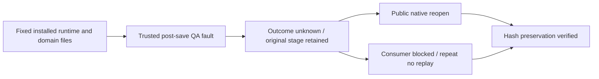

# ArtCraft Current Failed Stage Acceptance Architecture

Current fixed plugin130/source102/runtime129 passes24 post-save fault cases across four native domains and one binding test (zero skips). Actual installed runtime modules drive real native processes. The trusted QA hook corrupts only replies after successful native saves; it is controlled fault injection, not a naturally observed transport failure. Every product-retained original stage reopens via its domain public command gateway. Downstream remains blocked, repeat attempts/budgets remain unchanged and native save count remains one. Film registered input bytes are preserved. All24 QA directories are retained; failed-stage file hashes are rechecked.

Four-domain preserved_stage.py identity appears in installer files, capability snapshot and prepared launcher; missing and changed config digest refuse before output writes. Ten actual host Art tree digests and all pinned child/core file hashes remain correct. Current130 cold mixed revision/source inspection/reuse and moved delivery proof, plus unchanged ten-entry cold proof, cover the remaining distribution clauses. Historical Art79 evidence remains separately hashed; immutable releases are unchanged.

Eight of14 runtime scenarios are verified; task4.6 and12 numbered tasks remain open. The new binding test is opt-in; normal CI skips native opt-ins. No production skills/runtime changed.

[Clause evidence](evidence/current-failed-stage130-20261009.json).
