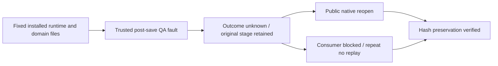

# ArtCraft 当前失败暂存保全验收架构

当前固定plugin130/source102/runtime129通过四领域24项保存后故障及1项绑定测试，零跳过。实际安装运行时模块驱动真实原生进程；受信QA钩子只在原生保存成功后破坏响应，这是受控故障注入，不宣称自然发生的网络故障。每个由产品保留的原始暂存工程均通过对应领域公开命令入口重开。下游阻断、重复attempt／预算不变，保存次数保持一次；Film登记输入字节保全。全部24个QA目录保留，暂存文件摘要已复核。

四领域preserved_stage.py同时绑定安装files、能力快照及prepare启动身份；缺失或配置摘要漂移均在输出写入前拒绝。十个真实宿主Art目录及全部固定子包／核心文件摘要不变。当前130空缓存混合修订、源检查／复用及移动交付证据，结合未变化的十入口冷启动证据，覆盖剩余分发条款。历史Art79证据独立保留并绑定摘要，不改写不可变发行。

14场景中8项已验收，任务4.6与12个编号任务继续开放。新增绑定测试需显式启用，常规CI跳过原生条件测试；生产技能及运行时未修改。

[Clause evidence](evidence/current-failed-stage130-20261009.json).
