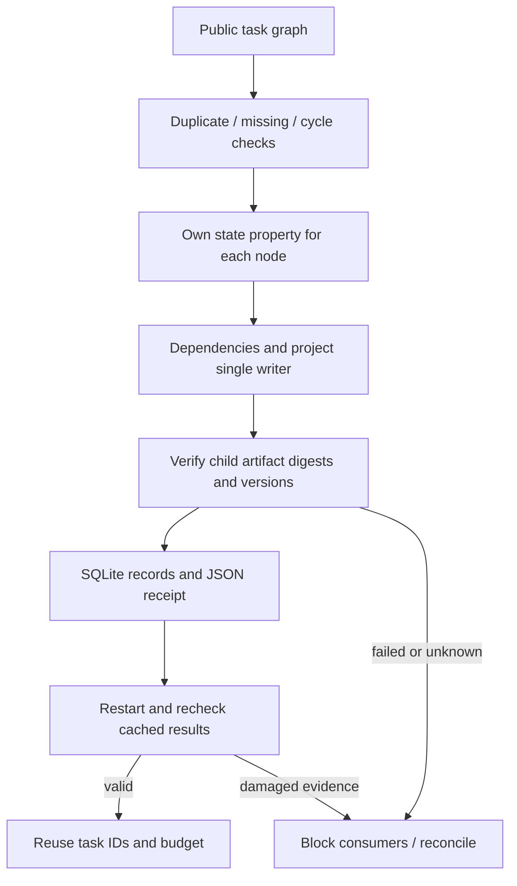

# ArtCraft DAG Node Identity Architecture

This document covers the AC-DM-003 scheduler identity fix for implementation, skill maintenance and acceptance. Plugin OpenSpec owns behavior; standalone skills pin the runtime, and the plugin vendors immutable skill snapshots. [Implementation evidence](evidence/dag-identity-implementation-20261008.json).

Legal IDs such as `__proto__`, `constructor` and `toString` previously collided with inherited object properties or the prototype setter, incorrectly blocking a valid dependency chain. The scheduler now uses `Object.fromEntries` over the validated topological order to create an own writable data property for every node. Scheduling, persistence and consumer verification retain their existing paths. Legal IDs, public JSON, artifact protocols and node fingerprints are unchanged.

| Contract | Implementation and verification |
| :--- | :--- |
| Opaque IDs | Three special names form a real local child-process dependency chain; all results are own properties and survive JSON roundtrip. |
| Verified handoff | Consumers receive verified parent artifacts; inherited properties cannot fabricate readiness. |
| Recovery and budget | A new scheduler uses the same durable ledger and reuses task IDs, budget and outputs without launching new processes. |
| Other scheduling | Cycle/missing-node checks, parallelism, same-project serialization, damaged cache, cancellation and crash recovery regressions continue to pass. |
| Release boundary | Published runtime126 bytes match the downloaded archive; fixed source98/plugin126 installation requires separate evidence. |

The regression failed before the fix because `blocked` differed from `review_ready`, then passed. Runtime regression: 299 tests, 278 passed and 21 conditional skips. CLI regression was rerun after updating the version field. Domain versions, the 2646-command catalog and native formats retain their existing contracts. Upgrades use separate version directories and preserve old runtimes; rolling back to a defective old version does not preserve this fix.

This proves the scheduler fix and affected regressions. The complete four-domain native concurrent/single-writer matrix, generic Skills CLI, GUI, human creative approval and full V1 require separate acceptance; task6.9 remains open. A passing fixed-install scenario does not automatically close that matrix.
