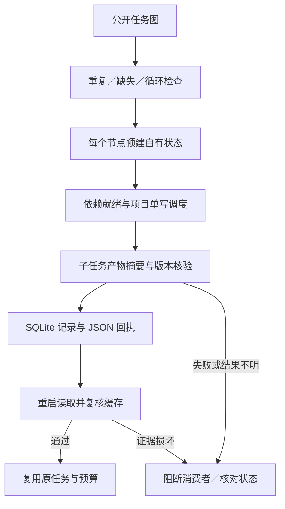

# ArtCraft DAG 节点身份架构

本文记录 AC-DM-003 的调度器节点身份修复，供实施、技能维护和验收使用。规格事实源为插件 OpenSpec；独立技能固定运行时，插件接收不可变技能快照。[核心实现证据](evidence/dag-identity-implementation-20261008.json)。

合法 ID 为 `__proto__`、`constructor` 或 `toString` 时，旧结果对象会读到继承属性或触发原型赋值，导致依赖链错误阻断。新实现按已验证的拓扑序，以 `Object.fromEntries` 预建每个节点的自有可写数据属性；调度、保存和消费者验证继续使用原有路径。不限制合法 ID，也不改变公共 JSON、素材协议或节点指纹。

| 契约 | 实现与验证 |
| :--- | :--- |
| 不透明 ID | 三个特殊名称组成真实本地子进程依赖链，返回值均为自有记录，JSON 往返保留。 |
| 有序交接 | 消费者只接收已通过摘要核验的父产物；继承属性无法伪造结果。 |
| 恢复与预算 | 新建调度器读取同一持久账本，原任务 ID、预算及输出复用，无新进程。 |
| 其他调度行为 | 现有循环／缺失节点、并行与同项目单写、坏缓存、取消和崩溃恢复回归继续通过。 |
| 发布边界 | runtime126 生产字节已发布并回读相等；source98 与插件126的固定安装证据必须另行记录。 |

新增用例修复前因 `blocked` 与预期 `review_ready` 不符而失败，修复后通过；运行时回归 299 项中 278 通过、21 项按条件跳过。版本字段更新另跑 CLI 回归。领域分发版本、2646 条命令目录和原生格式保持既有契约。安装升级采用独立版本目录，不覆盖旧运行时；旧版本仍含此缺陷，恢复旧版本不能证明修复保留。

这证明调度器修复及受影响回归。四领域原生并发／单写完整矩阵、通用 Skills CLI、GUI、人工创作接受和完整 V1 仍需各自验收，6.9 保持开放。固定安装场景若通过，也不自动关闭上述矩阵。

固定插件126／源98／runtime126安装后已通过：64技能发现且零错误、十项Art独立冷安装、64项CLI探测、四领域特殊ID原生创建／复用／移动包及安装树保全。[固定证据](evidence/craft-art126-dag-identity-fixed-first-use-20261008.json)。此前source候选待验描述为历史发布检查点；6.9仍开放。

全工作区来源审计因四领域当前工作树偏离固定标签而拒绝；Art技能工作树匹配源98。固定发行归档、实际宿主技能和冷安装副本均已按锁独立核验，不能据此宣称五个当前工作树均匹配固定引用。其他仓库未被修改。该来源审计拒绝与32项未完成任务一并保留。
