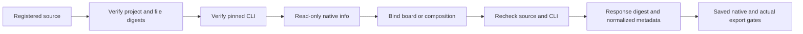

# ArtCraft design source Brief inspection architecture

Status: local candidate only. Task `6.28` remains open. The specification authority is `AC-DM-001-SOURCE-DESIGN` in `establish-v1-plugin`.

## Identity and read-only inspection

The public skill adapter resolves the registered source delivery, verifies its native project reference, manifest digest and every manifest file. It checks the pinned CLI digest before and after inspection. Model-provided inspection responses, local project paths and executor paths are not accepted.

| Domain | Read-only command | Fields | Target binding |
| --- | --- | --- | --- |
| PhotoCraft | `info <project.pcraft>` | width, height | Registered native project |
| EffectCraft | `--project <project.ecproj> run comp.info <bound ID JSON> --json` | Selected composition dimensions, frameRate, duration | manifest.bindings.composition.comp must match response composition id |
| VectorCraft | `info <project.vectorcraft>` | artboards[index].rect width and height | N−1 from primary artboard-N.png/svg/pdf delivery |

Dimensions must be integers from 1 to 16384. Board rectangles require four finite numbers and positive integer dimensions. Effect frame rate must be from 1 to 240 and duration finite and positive. Missing or mismatched targets produce `brief_source_inspection_invalid`; no default board or alternate composition is substituted.

## Candidate boundaries

`parseDesignSourceInspection` parses the response; `publicSkillFactory` owns file and executable checks. Response file/path fields never become local references. Calls have a 30-second timeout and an 8 MiB response limit. Inspection acquires no write lease and preserves the source; preparation files belong to the task output root.

All four domains can defer blocks caused only by unknown native metadata when a registered source and valid expectedRevision are resolvable. Authority, budget, brand, ambiguity and dependency conflicts remain blocked. Photo/Vector video timing requirements report capability_missing before dependency downloads.

image.imageSize/image.canvasSize, comp.settings and artboard.new/artboard.setProps may change metadata. Declaration assessment reports native_output_inspection_required and the actual saved-output gate decides compliance. Fresh documents use the same gate. A new board uses the registered source board for initial inspection and the requested new delivery board for final verification, without substituting a default board.

verifyNativeBriefOutput verifies the manifest, native project and native.json digest chain before ledger readiness, then checks saved dimensions, Effect composition identity/frame rate/duration, Film frame rate and Vector primary board bounds. Primary PNG output dimensions are read from its actual IHDR; this is not full pixel or visual review. Dependency handoff and cached reuse repeat the checks against current files.

For Effect MP4 output, the pinned CLI runs file.import, project.summary and file.interpretFootage without setting changes in an empty in-memory project. It reads unique video dimensions, duration and frame rate, opens/saves no creative project and requires no global FFprobe. Exit zero with import errors still fails. Export dimensions/frame rate must match; container duration allows one export frame, while saved composition duration must match within 1e-9 seconds. Video bytes and CLI digests are checked before and after probing.

## Verification and remaining work

Unit cases cover invalid board indexes, composition mismatch and invalid dimensions/timing. The native mixed test inspects all three moved source deliveries through the same adapter, verifies metadata, source digests and zero leases. This proves the read-only interface, not cold installation or full Brief acceptance.

Real revisions cover source Briefs for all three domains, reuse, wrong-size early rejection, legal resizing and native exit-zero results that fail the saved-output gate with no published outputs. Additional cases cover Vector board creation and actual Effect video duration rejection. Original source/dependency digests remain intact and no leases remain.

Python declaration policy is synchronized across ten independent self-contained skills. Fixed runtime and skill releases still point to the previous versions. These changes have not been published or vendored, so installed availability is not established. Fixed-release cold acceptance, broader boundaries and creative acceptance remain required; task 6.28 stays open.
