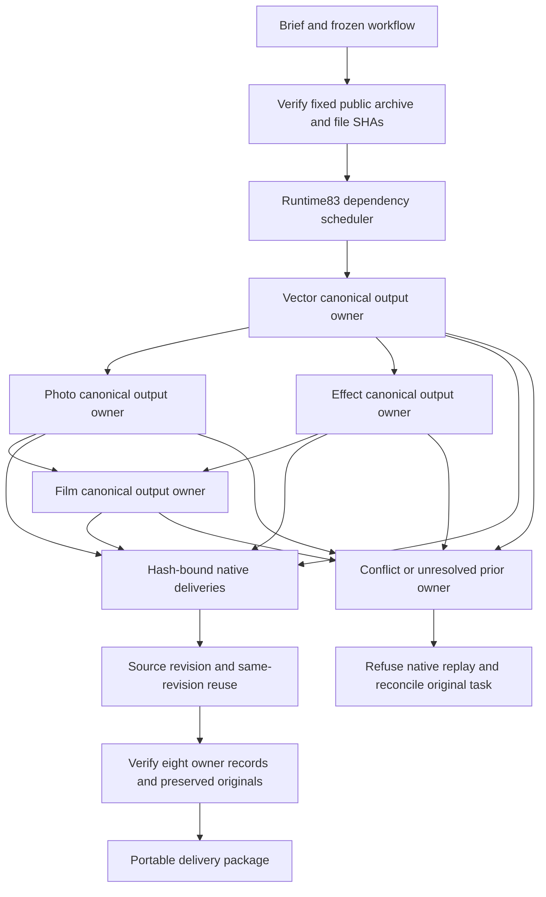

# ArtCraft Domain Execution Architecture

## Scope and release boundaries

SC-008 pins Film29, Effect30, Photo30 and Vector29 in all ten independent Art skills. Runtime83 and the Film bundle remain byte-identical to Art99. Source74 candidate and plugin100 fixed installation have separate gates. The update changes dependency locks and the immutable2646-command index, without changing the scheduler runtime or native binaries.

## Components and execution flow

Each public domain workflow claims its own canonical delivery target before its native session, after verifying the runtime. Records bind effective plan, input, source revision and native executable SHAs. Art's task-specific output targets isolate deliveries. Source revisions use new targets; same-revision reuse preserves completed record bytes. This is domain output protection, rather than a new cross-domain global lease or automatic task recovery policy.

## First use and failure handling

Every Art role carries the same distribution lock and command index, with no sibling-skill requirement. Public archives are compared with immutable Git tag bytes and every file is verified. Native binaries remain unchanged. A failed installer occurs before domain claims; domain running/reconciling records are not removed for retry. The existing Art scheduler continues to own dependency state and budget accounting; this dependency update does not establish missing cancellation, worker-fault or unknown-submission contracts.

## Acceptance evidence

The candidate and fixed tests each copy one Art skill, start with an empty runtime and download default public dependencies. They create four editable native children, revise their source projects, assert all eight records against effective plans, input inventories, original project SHAs and native binaries, preserve records on reuse, reject receipt conflicts and verify a moved package. CLI/discovery, technical native fixtures and creative acceptance remain separate evidence scopes. Generic Skills CLI installation and complete V1 remain open.
