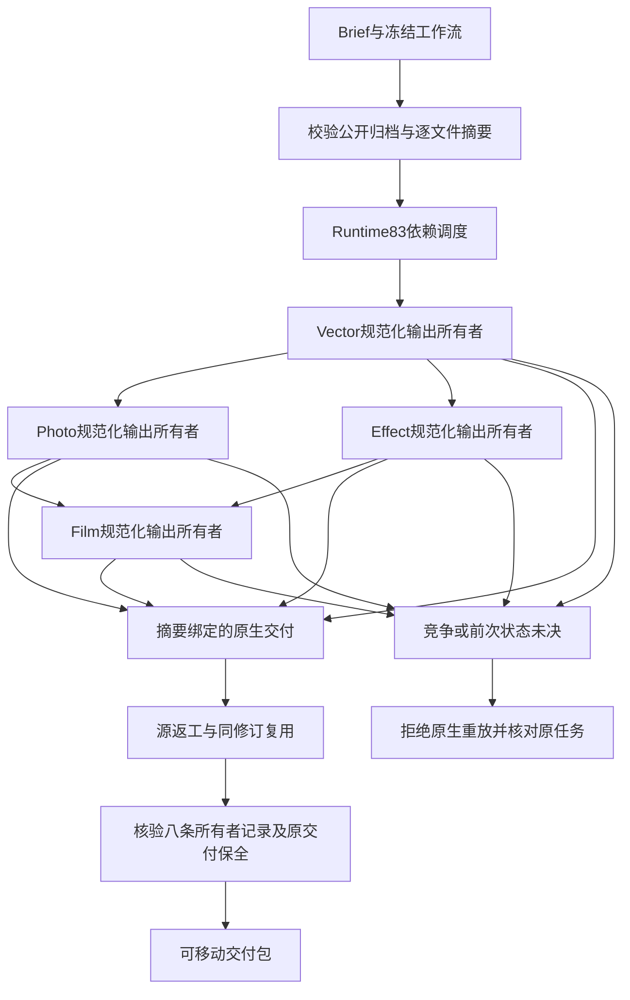

# ArtCraft 领域执行架构

## 范围与发行边界

SC-008 在十个独立 Art 技能中固定 Film29、Effect30、Photo30、Vector29。Runtime83与Film包保持Art99时的原字节。源74候选与插件100固定安装分别验收。变更更新依赖锁和不可变2646条命令索引，不修改调度运行时或原生二进制。

## 组件与执行流程

各领域公开工作流在运行时校验后、原生会话前认领自身规范化交付目标，记录实际计划、输入、原工程修订和原生二进制摘要。Art为每个任务使用独立输出目标；源返工使用新目标，同修订复用保持完成记录字节不变。这是领域输出保护，不是新增的跨领域全局租约或自动任务恢复策略。

## 首次使用与失败处理

各 Art 角色携带相同分发锁与命令索引，不依赖兄弟技能。公开归档与不可变 Git 标签字节比较，并核验全部文件，原生二进制不变。安装失败发生在领域认领前；running／reconciling记录不能因重试而删除。已有Art调度器继续负责依赖状态及预算核算，本次依赖升级不证明尚未验收的取消、worker故障或未知提交合同。

## 验收证据

候选和固定测试分别只复制单个 Art 技能，从空运行时下载默认公开依赖，创建四个可编辑原生子工程并返工。八条记录均对照实际计划、素材清单、原工程与原生二进制摘要，复用保持记录字节，安装回执冲突被拒绝，移动交付包验证通过。CLI／发现、原生技术样例与创作验收区分。通用Skills CLI安装和完整V1仍开放。
