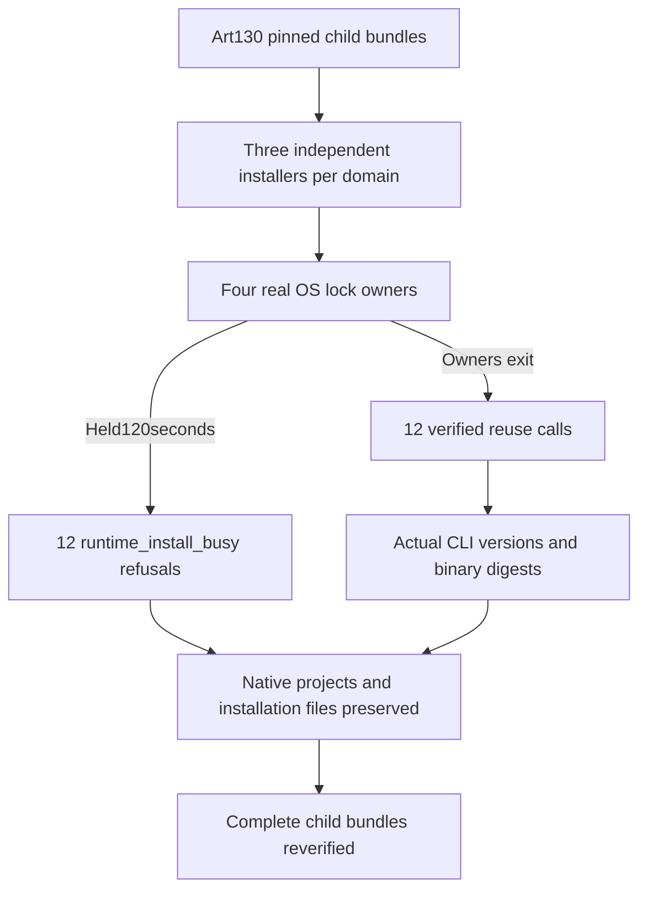

# ArtCraft Fixed Domain Installation Mutex Acceptance Architecture

The four-domain CLI concurrent installation/reuse scenario is now verified against plugin130/source102/runtime129. Task4.6 remains open; two of its14 scenarios have current fixed mutex acceptance evidence.

The test uses complete immutable child skill bundles actually installed by Art, not domain working trees or standalone domain plugins. It first verifies all four bundles against Art distribution locks. Three independent Python installer calls per domain wait for the same real OS lock. All12 calls return runtime_install_busy after the production120-second wait while owners remain alive. In another round, all four owners are terminated while12 calls wait; every waiter acquires ownership and reuses the original installation. Each reuse verifies binarySha256 against both the lock and actual executable, and executes --version against locked versionOutput. All four complete child bundles are verified again afterwards.

[Fixed domain mutex evidence](evidence/fixed-domain-mutex-acceptance130-20261009.json) records24 calls, three parallel waiters, actual versions and protected project/file digests. Warm reuse is not a fresh download/install test; no native editing or rendering occurs. The initial driver incorrectly assumed sha256/version receipt fields; only its owned QA process tree was stopped, the diagnostic retained, and the corrected driver rerun using actual binarySha256/executable/reused fields plus executable version probes. The final installed test passes in126.239seconds on Python3.13.5.

Three historical routing mistakes are corrected: failed-stage evidence must use Art79 rather than standalone domain acceptance that excludes Art; inner JSON uses Art81 bundled fault/cold/mixed evidence rather than standalone command-component acceptance; strict plans use the updated Art97 distribution rather than unchanged Art96. Invalid references and reasons remain recorded. Correct routing alone closes no scenario.

All four current bootstrap digests differ from historical native-download-recovery evidence, so the [scenario audit](evidence/runtime-upgrade-scenario-audit130-20261009.json) keeps download recovery open pending change/coverage audit or fresh verification. Immutable releases remain unchanged, domain repositories are not edited, and neither task4.6 nor full V1 is archived.
