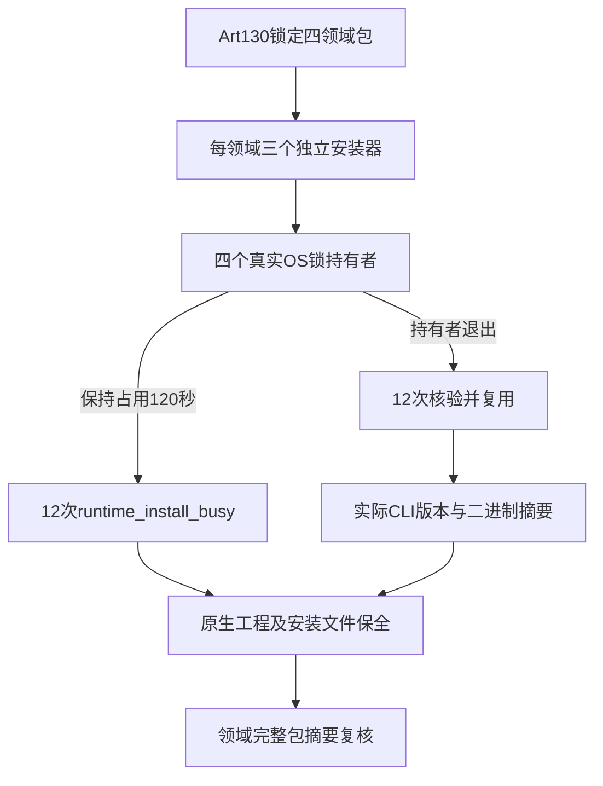

# ArtCraft 固定领域安装互斥验收架构

插件130／源102／runtime129锁定的四领域CLI并行安装与复用场景已补齐当前验收。任务4.6仍开放，14场景中两个互斥场景具有当前发行的完整专项证据。

本次使用Art实际安装的不可变完整领域技能源，而非领域工作区或独立领域插件。测试先按Art分发锁核验四个完整领域包，每领域三个独立Python安装器调用同时等待同一真实OS锁。12个调用均在生产120秒等待后返回runtime_install_busy，持锁者持续存活；另一轮等待期间终止四个持锁进程，12个调用取得锁并复用原安装。每个复用结果核验binarySha256及真实可执行文件摘要，并实际执行--version与锁定versionOutput比较。最后再次核验四个完整领域包。

[固定领域互斥证据](evidence/fixed-domain-mutex-acceptance130-20261009.json)记录24调用、三等待者并行、实际版本、受保护工程和文件摘要。温缓存复用不称为全新下载安装，不执行原生编辑或渲染。最初驱动错误地假定安装回执包含sha256/version；发现后只停止自有QA进程树，保留中止诊断，再按真实binarySha256/executable/reused字段及实际版本探测重跑。最终专项1项通过、耗时126.239秒，使用Python3.13.5。

14场景证据路由另纠正三处范围错误：失败暂存应引用Art79而非明确排除Art的独立领域验收；内层JSON应引用Art81捆绑故障／冷安装／混合证据而非单命令组件；严格计划应引用更新后的Art97分发而非未更新的Art96。原错误引用及不适用原因保留，纠正引用不自动关闭场景。

当前四领域bootstrap摘要都与历史原生下载恢复验收不同，因此[场景审计](evidence/runtime-upgrade-scenario-audit130-20261009.json)保留下载恢复开放，后续核对变化或补验，不能直接沿用旧成功。现有固定发行制品不变，不修改领域仓库，不归档4.6或完整V1。
