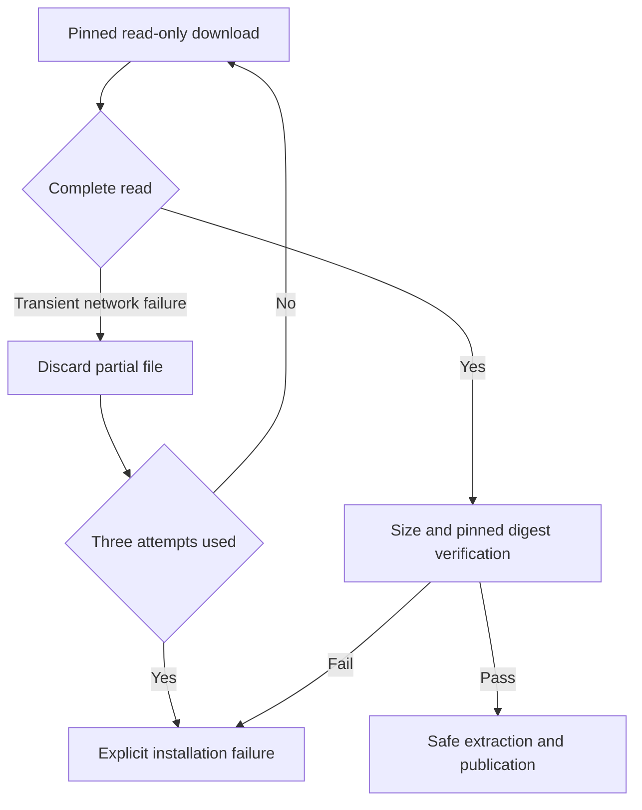

# ArtCraft first-download recovery

Node and domain-skill archives are pinned read-only downloads. Transient connections, TLS EOF, timeouts and HTTP 408/429/5xx receive at most three attempts, discarding partial files each time, with one- and two-second delays. Editing operations are never retried. HTTP403, certificate verification, filesystem, size and digest failures still fail. Each request keeps its 60-second timeout. Existing archive/file/binary checks remain mandatory after a complete download.

This change belongs to the standalone Art installer. The four native domain CLI downloaders retain their own behavior. Tests cover partial-read recovery, attempt limits, HTTP denial/filesystem/size errors and source-skill regressions. Ten public cold installations, immutable publication and actual installed-host copies still require separate evidence before OpenSpec4.8 closes.
